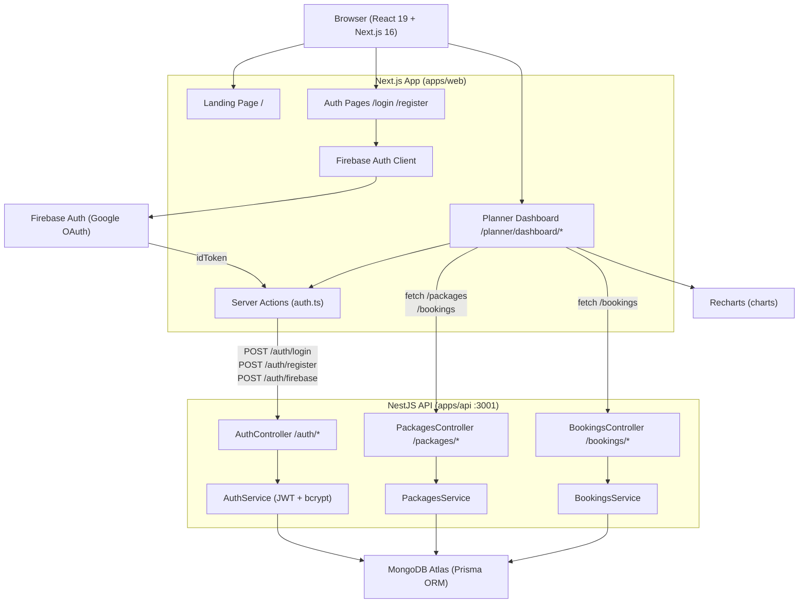
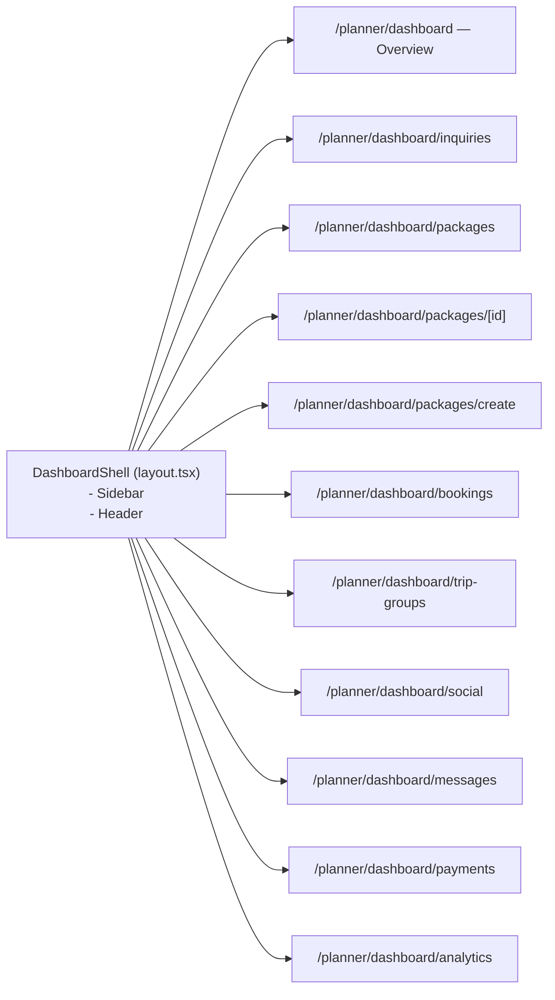
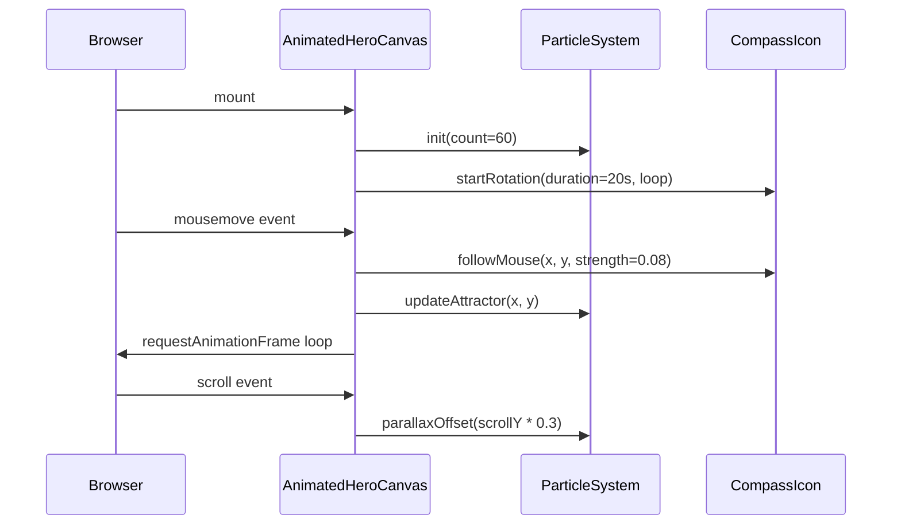
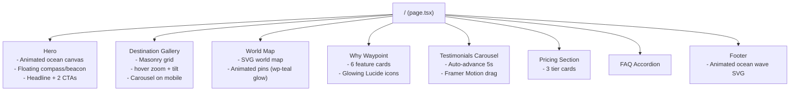
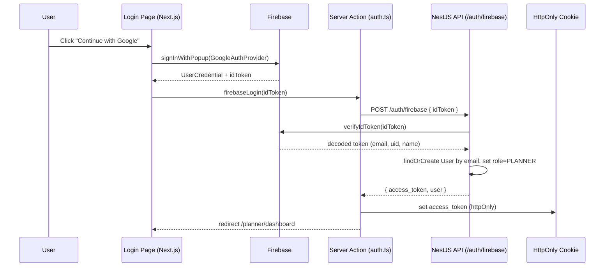
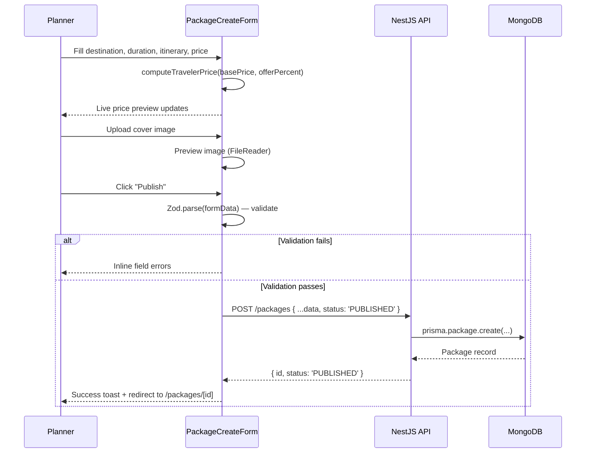
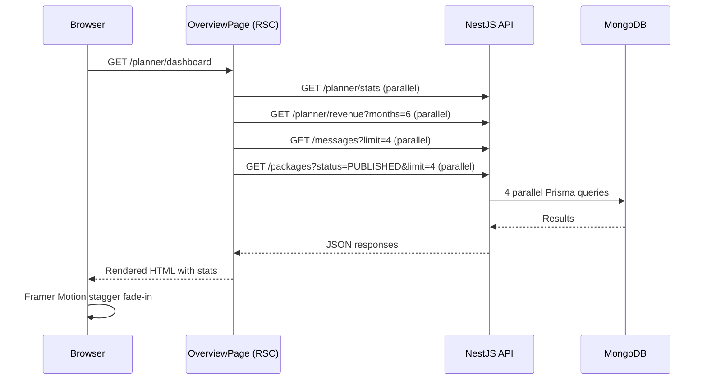

# Design Document: Waypoint — Trip Planner Dashboard

## Overview

Waypoint is a premium, AI-powered travel planner web application built on top of the existing Beacon platform. It replaces the current basic `/planner/dashboard` scaffold with a visually immersive management suite — navy-teal-cyan ocean palette, glassmorphism surfaces, Framer Motion animations — while extending the existing Next.js 16 App Router codebase, NestJS API, and MongoDB/Prisma data layer.

The feature covers two high-level areas: (1) a fully redesigned landing page with animated ocean hero, interactive destination gallery, world-map pins, and social proof sections; (2) a nine-section planner dashboard (Overview, Inquiries, Packages, Bookings, Trip Groups, Social Media, Messages, Payments, Analytics) housed in a persistent shell with a collapsible dark-navy sidebar and a sticky header. Firebase Authentication is added for Google Sign-In on the client side while the existing cookie-based JWT on the NestJS backend remains the authoritative session.


---

## Architecture

### High-Level System Architecture



### Dashboard Route Layout




---

## Design System

### Color Tokens (Tailwind CSS v4 `@theme`)

| Token | Hex | Usage |
|-------|-----|-------|
| `--wp-navy` | `#002349` | Sidebar bg, primary text on dark |
| `--wp-teal` | `#0097A6` | Brand actions, buttons, links |
| `--wp-cyan` | `#00CBE0` | Accents, glows, chart highlights |
| `--wp-white` | `#FFFFFF` | Card surfaces |
| `--wp-bg` | `#F0FAFB` | Page background |
| `--wp-border` | `#D6EEF1` | Card borders, dividers |
| `--wp-muted` | `#5C7A88` | Secondary text, labels |

### Typography

| Font | Variable | Use case |
|------|----------|----------|
| Space Grotesk | `--font-space-grotesk` | Headings, stat numbers, display |
| Inter | `--font-inter` | Body copy, UI labels |
| IBM Plex Mono | `--font-ibm-mono` | Booking IDs, prices, amounts |

### Global CSS additions to `globals.css`

```css
@theme inline {
  --color-wp-navy:  #002349;
  --color-wp-teal:  #0097A6;
  --color-wp-cyan:  #00CBE0;
  --color-wp-bg:    #F0FAFB;
  --color-wp-border:#D6EEF1;
  --color-wp-muted: #5C7A88;
  --font-display:   var(--font-space-grotesk), var(--font-sans);
  --font-mono:      var(--font-ibm-mono), monospace;
}
```

### Component Primitives

- **GlassCard**: `bg-white/80 backdrop-blur-lg border border-wp-border rounded-2xl shadow-sm hover:-translate-y-1 transition-all`
- **StatCard**: GlassCard + icon slot (teal tinted) + trend badge + large number (Space Grotesk)
- **BoardingPassCard**: gradient header (navy→teal), badge pill, day/spot count, price with strikethrough, rounded-2xl
- **StatusPill**: `rounded-full px-3 py-1 text-xs font-semibold` — New=cyan-tint, Replied=teal-tint, Converted=navy-tint, Confirmed=green, Pending=amber, Cancelled=red
- **NavItem**: `flex gap-3 px-4 py-3 rounded-xl font-medium` with active state via `bg-wp-teal/10 text-wp-teal`


---

## Components and Interfaces

### 1. DashboardShell (`src/app/planner/dashboard/layout.tsx`)

**Purpose**: Persistent layout wrapper for every dashboard route — sidebar + header.

**Interface**:
```typescript
interface DashboardShellProps {
  children: React.ReactNode;
}

interface NavGroup {
  label: string;
  items: NavItem[];
}

interface NavItem {
  href: string;
  label: string;
  icon: LucideIcon;
  badgeCount?: number; // unread indicator
}

const NAV_GROUPS: NavGroup[] = [
  {
    label: 'Workspace',
    items: [
      { href: '/planner/dashboard', label: 'Overview', icon: LayoutDashboard },
      { href: '/planner/dashboard/inquiries', label: 'Inquiries', icon: MessageCircle },
      { href: '/planner/dashboard/packages', label: 'Packages', icon: Package },
      { href: '/planner/dashboard/bookings', label: 'Bookings', icon: CalendarCheck },
      { href: '/planner/dashboard/trip-groups', label: 'Trip Groups', icon: Users },
    ],
  },
  {
    label: 'Grow',
    items: [
      { href: '/planner/dashboard/social', label: 'Social Media', icon: Share2 },
      { href: '/planner/dashboard/messages', label: 'Messages', icon: MessageSquare },
      { href: '/planner/dashboard/payments', label: 'Payments', icon: Wallet },
      { href: '/planner/dashboard/analytics', label: 'Analytics', icon: BarChart3 },
    ],
  },
];
```

**Responsibilities**:
- Render dark navy sidebar (fixed, 256px) with grouped nav items and planner profile chip at bottom
- Render sticky top header with global search input and notification bell (unread dot)
- Collapse sidebar to icon-only rail on `lg:` breakpoint toggle; drawer overlay on mobile
- Highlight active `NavItem` via `usePathname()` prefix matching
- Provide logout action via server action call


### 2. Overview Section (`/planner/dashboard/page.tsx`)

**Purpose**: At-a-glance business metrics, revenue chart, recent messages, and live packages.

**Interface**:
```typescript
interface OverviewStats {
  activeBookings: number;
  newInquiries: number;
  packagesLive: number;
  travelerRating: number; // 0–5, one decimal
}

interface RevenueDataPoint {
  month: string;       // e.g. "Jan"
  revenue: number;     // INR
}

interface RecentMessage {
  id: string;
  travelerName: string;
  avatarUrl?: string;
  preview: string;
  timestamp: string;
  unread: boolean;
}
```

**Responsibilities**:
- Fetch stats, revenue series, recent messages, and live packages via API or mock data server-side
- Render 4 `StatCard` components in a responsive 2×2 → 4-column grid
- Render `RevenueAreaChart` (Recharts `AreaChart`) with gradient fill, ₹ tooltip, trend badge
- Render `RecentMessagesPanel` (last 4 conversations with avatar + preview)
- Render `LivePackagesGrid` (2–3 `BoardingPassCard` components)

### 3. Inquiries Section (`/planner/dashboard/inquiries/page.tsx`)

**Purpose**: Manage incoming traveler inquiries, reply, and track conversion.

**Interface**:
```typescript
type InquiryStatus = 'NEW' | 'REPLIED' | 'CONVERTED';

interface Inquiry {
  id: string;
  travelerName: string;
  travelerAvatarUrl?: string;
  packageTitle: string;
  message: string;
  timestamp: string;
  status: InquiryStatus;
}

interface InquiryFilterTab {
  label: string;
  value: InquiryStatus | 'ALL';
  count: number;
}
```

**Responsibilities**:
- Render filter tab bar: All / New / Replied / Converted with counts
- Render `InquiryCard` per item with status pill, traveler avatar, package name, message excerpt, Reply CTA
- Status pill colors: NEW=cyan-tint (`bg-wp-cyan/10 text-wp-cyan`), REPLIED=teal-tint, CONVERTED=navy-tint
- Reply action opens inline textarea or modal; on submit dispatches API call and optimistically updates status


### 4. Packages Section (`/planner/dashboard/packages/`)

**Purpose**: Full CRUD lifecycle for travel packages — list, create/edit form, and detail view.

**Interface**:
```typescript
interface PackageCardData {
  id: string;
  title: string;
  destination: string;
  duration: number;         // days
  basePrice: number;
  discountedPrice?: number;
  status: 'DRAFT' | 'PUBLISHED' | 'ARCHIVED';
  spotsTotal?: number;
  spotsBooked?: number;
  coverImageUrl?: string;
}

interface ItineraryDayInput {
  dayNumber: number;
  location: string;
  hotel: string;
  hotelRating: number;      // 1–5
  meals: string[];          // ['Breakfast', 'Lunch', 'Dinner']
  notes?: string;
}

interface PackageFormData {
  destination: string;
  duration: number;         // triggers dynamic day-card generation
  itinerary: ItineraryDayInput[];
  fareIncludes: string[];   // tag-input
  fareExcludes: string[];
  basePrice: number;
  offerPercent?: number;    // 0–100
  coverImageFile?: File;
  status: 'DRAFT' | 'PUBLISHED';
}

interface PackageDetailStats {
  travelersBooked: number;
  paymentsDone: number;
  remindersPending: number;
  genderSplit: { male: number; female: number; other: number };
}

interface TravelerPaymentRow {
  bookingId: string;
  travelerName: string;
  avatarUrl?: string;
  gender: string;
  phone: string;
  amount: number;
  paymentStatus: 'PAID' | 'PENDING';
}
```

**Responsibilities**:
- **Package List** (`packages/page.tsx`): Grid of `BoardingPassCard`, "New Package" button
- **Create/Edit Form** (`packages/create/page.tsx`, `packages/[id]/edit/page.tsx`):
  - React Hook Form + Zod validation
  - Duration field change dynamically adds/removes `ItineraryDayCard` components (animated with Framer Motion `AnimatePresence`)
  - Tag input for fare includes/excludes
  - Live traveler-price preview: `Math.round(basePrice * (1 - offerPercent/100))`
  - Cover image drag-and-drop upload
  - Save as Draft / Publish buttons dispatch POST/PATCH to `/packages`
- **Package Detail** (`packages/[id]/page.tsx`):
  - Hero banner (cover image + gradient overlay)
  - 4 stat tiles, donut chart (Recharts `PieChart`) for gender split
  - Traveler payments data table with Paid/Pending pill and reminder bell icon

### 5. Bookings Section (`/planner/dashboard/bookings/page.tsx`)

**Interface**:
```typescript
interface BookingRow {
  id: string;               // displayed in IBM Plex Mono
  travelerName: string;
  packageTitle: string;
  travelDate: string;
  amount: number;           // displayed in IBM Plex Mono
  status: 'CONFIRMED' | 'PENDING' | 'CANCELLED';
}
```

**Responsibilities**:
- Data table with columns: Booking ID (mono), Traveler, Package, Date, Amount (mono), Status pill, ⋯ overflow menu
- Overflow menu: View Details, Cancel Booking
- Skeleton loading state; empty state illustration when no bookings


### 6. Trip Groups Section (`/planner/dashboard/trip-groups/page.tsx`)

**Interface**:
```typescript
interface TripGroup {
  id: string;
  name: string;
  memberCount: number;
  departureDate: string;
  iconEmoji: string;
  unreadCount: number;
}
```

**Responsibilities**:
- Grid of `GroupCard` components (icon badge, unread count badge, group name, member count + departure date)
- "New Group" button (modal form: name, package link, departure date)
- Placeholder chat pane (future phase) shown as empty state with illustration

### 7. Social Media Section (`/planner/dashboard/social/page.tsx`)

**Interface**:
```typescript
type SocialPlatform = 'INSTAGRAM' | 'FACEBOOK' | 'YOUTUBE' | 'WHATSAPP_BUSINESS';

interface PlatformConnection {
  platform: SocialPlatform;
  connected: boolean;
  handle?: string;
  followerCount?: number;
}

interface RecentShare {
  id: string;
  platform: SocialPlatform;
  thumbnailUrl: string;
  caption: string;
  sharedAt: string;
}
```

**Responsibilities**:
- 4 platform cards (Instagram, Facebook, YouTube, WhatsApp Business) with logo, connected pill or Connect button
- Auto-share toggle banner ("Automatically share new packages")
- Recent shares grid (thumbnail tiles with platform badge overlay)
- Connect flow: OAuth redirect or phone-number input depending on platform

### 8. Messages Section (`/planner/dashboard/messages/page.tsx`)

**Interface**:
```typescript
interface Conversation {
  id: string;
  travelerName: string;
  avatarUrl?: string;
  lastMessage: string;
  timestamp: string;
  unreadCount: number;
}

interface Message {
  id: string;
  senderId: string;
  text: string;
  attachmentUrl?: string;
  timestamp: string;
}
```

**Responsibilities**:
- Two-panel layout: left conversation list (selected state highlighted wp-teal/10), right active thread
- Message bubbles: planner=right (teal bg), traveler=left (white bg)
- Reply input with attachment icon and send button
- Real-time polling fallback (500ms interval) until WebSocket is added

### 9. Payments Section (`/planner/dashboard/payments/page.tsx`)

**Interface**:
```typescript
interface PaymentBalance {
  availableBalance: number;
  currency: 'INR';
}

interface Transaction {
  id: string;
  direction: 'IN' | 'OUT';
  description: string;
  date: string;
  amount: number;
}
```

**Responsibilities**:
- Gradient balance card (navy→teal) with large ₹ amount (IBM Plex Mono) and "Withdraw to bank" CTA
- Transaction list: direction icon (↓ green for IN, ↑ red for OUT), description, date, signed amount in mono

### 10. Analytics Section (`/planner/dashboard/analytics/page.tsx`)

**Interface**:
```typescript
interface MonthlyBooking {
  month: string;
  count: number;
}

interface PackageRevenue {
  packageTitle: string;
  revenue: number;
  color: string;
}
```

**Responsibilities**:
- 6-month bookings bar chart (`Recharts BarChart`) with wp-teal fill
- Revenue by package donut chart (`Recharts PieChart`) with legend
- Date-range selector (last 3 / 6 / 12 months)


---

## Data Models

### Existing Prisma Models (extend, do not replace)

The MongoDB schema already covers `User`, `Profile`, `Package`, `PackageImage`, `ItineraryDay`, `Booking`, and `Payment`. New fields needed:

```typescript
// Prisma additions (schema.prisma)

model Package {
  // NEW fields
  offerPercent     Float?           // 0–100, used to compute discountedPrice at UI layer
  spotsTotal       Int?             // max group size for this package run
  tags             String[]         // fare-includes displayed as tags
}

model Inquiry {
  id              String   @id @default(auto()) @map("_id") @db.ObjectId
  plannerId       String   @db.ObjectId
  travelerId      String   @db.ObjectId
  packageId       String?  @db.ObjectId
  message         String
  status          InquiryStatus @default(NEW)
  createdAt       DateTime @default(now())
  updatedAt       DateTime @updatedAt
}

enum InquiryStatus {
  NEW
  REPLIED
  CONVERTED
}

model TripGroup {
  id              String   @id @default(auto()) @map("_id") @db.ObjectId
  plannerId       String   @db.ObjectId
  packageId       String?  @db.ObjectId
  name            String
  iconEmoji       String   @default("✈️")
  memberCount     Int      @default(0)
  departureDate   DateTime
  createdAt       DateTime @default(now())
}

model SocialConnection {
  id              String   @id @default(auto()) @map("_id") @db.ObjectId
  plannerId       String   @db.ObjectId
  platform        SocialPlatform
  handle          String?
  connected       Boolean  @default(false)
  autoShare       Boolean  @default(false)
  createdAt       DateTime @default(now())
}

enum SocialPlatform {
  INSTAGRAM
  FACEBOOK
  YOUTUBE
  WHATSAPP_BUSINESS
}

model ChatMessage {
  id              String   @id @default(auto()) @map("_id") @db.ObjectId
  conversationId  String
  senderId        String   @db.ObjectId
  text            String
  attachmentUrl   String?
  read            Boolean  @default(false)
  createdAt       DateTime @default(now())
}
```

### Frontend-only derived types (TypeScript interfaces in `src/types/waypoint.ts`)

```typescript
export interface PlannerProfile {
  id: string;
  name: string;
  email: string;
  avatarUrl?: string;
  companyName?: string;
  isVerified: boolean;
  role: 'PLANNER';
}

export interface DashboardContext {
  planner: PlannerProfile;
  stats: OverviewStats;
}
```


---

## Landing Page Design

### Sequence: Page Load → Hero Animation



### Landing Page Section Map



### Key Landing Page Components

**`OceanHeroCanvas`** (`src/components/landing/OceanHeroCanvas.tsx`):
- `<canvas>` element with animated sine-wave ocean layers (3 waves, phase offset, wp-cyan/teal fills, opacity 0.15–0.4)
- Floating particles (small circles, drifting upward, random opacity pulses)
- Beacon/compass icon at centre: SVG with rotating outer ring (Framer Motion `animate={{ rotate: 360 }}`, `repeat: Infinity`, `duration: 20`)
- Cyan glow ring (`box-shadow: 0 0 40px #00CBE0`) + ripple effect (scale pulsing circle)
- `onMouseMove` handler moves icon center with lerp smoothing

**`DestinationGallery`** (`src/components/landing/DestinationGallery.tsx`):
- 8 destination images in CSS masonry grid (3 cols desktop, 2 tablet, 1 mobile)
- Each image: `motion.div` with `whileHover={{ scale: 1.03, rotateX: 3, rotateY: 3 }}` tilt
- Overlay: destination name + country tag on hover (fade in)
- Mobile: horizontal carousel with Framer Motion drag constraints

**`WorldMapPins`** (`src/components/landing/WorldMapPins.tsx`):
- Inline SVG world map (simplified paths)
- Animated pins at 6–8 popular Indian + international destinations
- Each pin: pulsing cyan circle + location dot, tooltip on hover with destination name + package count


---

## Auth System Design

### Firebase + NestJS JWT Hybrid Flow



### Auth Pages

**`/login` (`src/app/login/page.tsx`)** — redesigned with:
- Animated gradient background (navy→teal left panel, white right panel)
- Email/password form (React Hook Form + Zod)
- "Continue with Google" button (Firebase `signInWithPopup`)
- Password strength indicator (zxcvbn-style color bar)
- Remember Me checkbox (extends cookie `maxAge` to 30d)
- Forgot Password link → Firebase `sendPasswordResetEmail`
- Success animation (Framer Motion check circle scale-in)

**`/register` (`src/app/register/page.tsx`)** — redesigned with:
- Same split layout
- Name, Email, Password, Role selector (TRAVELER / PLANNER)
- Profile photo upload (stored as base64 preview → upload to S3/Firebase Storage in background)
- Password confirmation + strength bar
- Terms checkbox, animated submit button

### New Server Action: `firebaseLogin`

```typescript
// src/actions/auth.ts (addition)
export async function firebaseLogin(idToken: string) {
  const res = await fetch(`${API_URL}/auth/firebase`, {
    method: 'POST',
    headers: { 'Content-Type': 'application/json' },
    body: JSON.stringify({ idToken }),
  });
  // ... same cookie-setting logic as login()
}
```

### New NestJS Endpoint: `POST /auth/firebase`

```typescript
// Validates Firebase idToken, finds-or-creates user, returns JWT
@Post('firebase')
async firebaseAuth(@Body() dto: { idToken: string }, @Res({ passthrough: true }) res: Response) {
  const { access_token, user } = await this.authService.loginWithFirebase(dto.idToken);
  res.cookie('access_token', access_token, { /* same options */ });
  return { message: 'Logged in', user };
}
```


---

## Algorithmic Pseudocode

### Key Functions with Formal Specifications

#### `computeTravelerPrice(basePrice, offerPercent)`

```typescript
function computeTravelerPrice(basePrice: number, offerPercent: number): number
```

**Preconditions:**
- `basePrice > 0`
- `offerPercent >= 0 && offerPercent <= 100`

**Postconditions:**
- Returns `Math.round(basePrice * (1 - offerPercent / 100))`
- Result is always `<= basePrice`
- Result is always `>= 0`

**Loop Invariants:** N/A (pure arithmetic)

#### `buildDayCards(duration)`

```typescript
function buildDayCards(duration: number): ItineraryDayInput[]
```

**Preconditions:**
- `duration >= 1 && duration <= 30`

**Postconditions:**
- Returns array of length `duration`
- Each element has `dayNumber = index + 1`
- Existing day data is preserved when duration decreases (truncate) or increases (append blank)

**Loop Invariant:** `cards[i].dayNumber === i + 1` for all `i` in `[0, duration)`

#### `filterInquiries(inquiries, activeTab)`

```typescript
function filterInquiries(
  inquiries: Inquiry[],
  activeTab: InquiryStatus | 'ALL'
): Inquiry[]
```

**Preconditions:**
- `inquiries` is a valid array (may be empty)
- `activeTab` is one of `'ALL' | 'NEW' | 'REPLIED' | 'CONVERTED'`

**Postconditions:**
- If `activeTab === 'ALL'`: returns all inquiries unchanged
- Otherwise: returns only inquiries where `inquiry.status === activeTab`
- Order of remaining elements is preserved

#### `interpolateMouseFollow(current, target, strength)`

```typescript
function interpolateMouseFollow(
  current: { x: number; y: number },
  target: { x: number; y: number },
  strength: number
): { x: number; y: number }
```

**Preconditions:**
- `strength > 0 && strength <= 1`
- `current` and `target` are valid 2D points

**Postconditions:**
- Returns `{ x: current.x + (target.x - current.x) * strength, y: current.y + (target.y - current.y) * strength }`
- Result is strictly between `current` and `target` when `0 < strength < 1`


---

## Sequence Diagrams

### Planner Creates and Publishes a Package



### Dashboard Stats Load (Overview)




---

## Animation and Interaction Patterns

### Framer Motion Conventions

```typescript
// Staggered fade-in for card grids
const containerVariants = {
  hidden: { opacity: 0 },
  visible: {
    opacity: 1,
    transition: { staggerChildren: 0.08, delayChildren: 0.1 },
  },
};

const itemVariants = {
  hidden: { opacity: 0, y: 16 },
  visible: { opacity: 1, y: 0, transition: { duration: 0.4, ease: 'easeOut' } },
};

// Hover lift (all cards)
const cardHover = {
  whileHover: { y: -4, boxShadow: '0 20px 40px rgba(0,151,166,0.15)' },
  transition: { duration: 0.2 },
};

// Animated counter (stat numbers)
// Uses framer-motion useMotionValue + useTransform + animate()
function AnimatedCounter({ to }: { to: number }) {
  const count = useMotionValue(0);
  useEffect(() => { animate(count, to, { duration: 1.2, ease: 'easeOut' }); }, [to]);
  const rounded = useTransform(count, Math.round);
  return <motion.span>{rounded}</motion.span>;
}

// Page transition wrapper
const pageTransition = {
  initial: { opacity: 0, x: 12 },
  animate: { opacity: 1, x: 0 },
  exit: { opacity: 0, x: -12 },
  transition: { duration: 0.25 },
};
```

### Skeleton Loading Pattern

Every data-dependent section renders `<Skeleton>` placeholders (shadcn/ui `Skeleton`) matching the shape of the real content. RSC Suspense boundary wraps each section:

```typescript
<Suspense fallback={<StatCardsSkeleton />}>
  <StatCardsSection plannerId={plannerId} />
</Suspense>
```

### Empty States

Every list/table has a dedicated empty state:
- Illustration (SVG inline, ocean-themed)
- Title (e.g., "No bookings yet")
- Subtitle with action suggestion
- Primary CTA button (e.g., "Create your first package")


---

## Error Handling

### Error Scenario 1: API Request Failure

**Condition**: Fetch to NestJS API returns non-2xx status (network error, 4xx, 5xx)
**Response**: Show toast notification (`shadcn/ui` Toaster) with error message from `data.message` or generic fallback "Something went wrong. Please try again."
**Recovery**: Retry button on error state; data remains from previous successful fetch (stale-while-revalidate pattern via Next.js `fetch` cache)

### Error Scenario 2: Package Form Validation Failure

**Condition**: Zod schema parse fails (missing required fields, price ≤ 0, duration out of range)
**Response**: Inline field-level error messages below each input (red text, red border); form does not submit
**Recovery**: User corrects fields; errors clear on change

### Error Scenario 3: Firebase Auth Failure

**Condition**: Google Sign-In popup cancelled, or Firebase token verification fails at NestJS
**Response**: Dismiss loading state; display "Sign-in was cancelled" or "Authentication failed. Please try again." below the Google button
**Recovery**: Google button re-enabled immediately; no page redirect

### Error Scenario 4: Image Upload Failure

**Condition**: Cover image file exceeds 5 MB or is not a valid image MIME type
**Response**: Inline error below drop zone: "File must be an image under 5 MB"
**Recovery**: Drop zone re-enabled; previous image preview (if any) restored

### Error Scenario 5: Unauthorized Access

**Condition**: User with TRAVELER role or unauthenticated user hits `/planner/dashboard/*`
**Response**: Next.js middleware (`src/middleware.ts`) redirects to `/login` with `?redirect=/planner/dashboard`
**Recovery**: After successful login with PLANNER role, redirect back to original URL


---

## Testing Strategy

### Unit Testing Approach

Test pure utility functions and derived computations in isolation using Vitest.

Key test cases:
- `computeTravelerPrice`: base price with 0%, 10%, 50%, 100% offer; boundary values
- `buildDayCards`: duration 1, duration 10, duration changing from 5→3 (truncation), 3→6 (append)
- `filterInquiries`: ALL tab returns all, specific status filters correctly, empty array input
- `interpolateMouseFollow`: strength 0.5 midpoint, strength 1.0 reaches target, strength 0.0 no movement

### Property-Based Testing Approach

**Property Test Library**: fast-check

Key properties:
- `computeTravelerPrice(b, o)`: result always `<= b` for any valid `b > 0`, `0 <= o <= 100`
- `computeTravelerPrice(b, 0)`: always returns `b` (identity for 0% discount)
- `buildDayCards(n).length === n` for any `n` in `[1, 30]`
- `buildDayCards(n)[i].dayNumber === i + 1` for all `i`
- `filterInquiries(inquiries, 'ALL').length === inquiries.length` for any input array
- `filterInquiries(inquiries, status)` result is subset of input with correct status

### Integration Testing Approach

API route tests using NestJS testing utilities (`@nestjs/testing`):
- `POST /auth/firebase` with valid/invalid Firebase idToken
- `POST /packages` returns 201 with correctly structured package
- `GET /packages?status=PUBLISHED` returns only published packages
- `GET /planner/stats` returns stats object with correct shape

End-to-end (Playwright) smoke tests:
- Planner logs in with email/password → redirected to dashboard
- Planner creates a package and publishes → appears in package list
- Planner views Overview → stat cards rendered with numbers


---

## Correctness Properties

*A property is a characteristic or behavior that should hold true across all valid executions of a system — essentially, a formal statement about what the system should do. Properties serve as the bridge between human-readable specifications and machine-verifiable correctness guarantees.*

### Property 1: Price Invariant

*For any* `basePrice > 0` and `offerPercent ∈ [0, 100]`, `computeTravelerPrice(basePrice, offerPercent)` SHALL return a value less than or equal to `basePrice`.

**Validates: Requirements 6.7**

### Property 2: Price Non-Negativity

*For any* valid `basePrice > 0` and `offerPercent ∈ [0, 100]`, `computeTravelerPrice(basePrice, offerPercent)` SHALL return a value greater than or equal to 0.

**Validates: Requirements 6.8**

### Property 3: Itinerary Completeness

*For any* `n ∈ [1, 30]`, `buildDayCards(n)` SHALL return an array of length `n` where every element at index `i` has `dayNumber === i + 1`.

**Validates: Requirements 6.3**

### Property 4: Filter Totality and Soundness

*For any* array of inquiries and any `status ∈ { NEW, REPLIED, CONVERTED }`: `filterInquiries(inquiries, 'ALL')` SHALL return all inquiries unchanged, `filterInquiries(inquiries, status)` SHALL include every inquiry whose `.status === status` and exclude every inquiry whose `.status !== status`, preserving relative order.

**Validates: Requirements 7.2, 7.3, 7.4**

### Property 5: Auth Cookie Atomicity

*For any* login attempt, the Auth_System SHALL either set the `access_token` cookie AND redirect to the appropriate dashboard, or return an error and set no cookie — never a partial state where the cookie is set without redirect or the redirect occurs without a valid cookie.

**Validates: Requirements 4.5**

### Property 6: Package Status Monotonicity

*For any* PUBLISHED package, the Packages_API SHALL only accept a status transition to ARCHIVED and SHALL reject any request to transition the status back to DRAFT.

**Validates: Requirements 6.13**

### Property 7: Mouse Interpolation Convergence

*For any* `strength ∈ (0, 1]`, repeated application of `interpolateMouseFollow(current, target, strength)` SHALL converge the position toward `target` within a finite number of steps, and when `strength === 1` the result SHALL equal `target` in a single step.

**Validates: Requirements 1.2**

### Property 8: Route Protection Universality

*For any* route under `/planner/dashboard/*`, any request without a valid PLANNER-role JWT SHALL be redirected to `/login` with the original path preserved in the `redirect` query parameter, with no dashboard content served.

**Validates: Requirements 5.1, 5.2**

### Property 9: Package Form Validation Rejection

*For any* package form submission where `basePrice ≤ 0`, `duration` is outside `[1, 30]`, or any required field is empty, THE Package_Form SHALL display inline errors and SHALL NOT dispatch an API request.

**Validates: Requirements 6.10**

### Property 10: Cover Image Validation

*For any* file dropped on the cover image zone, the Package_Form SHALL reject the file and display an inline error if and only if the file size exceeds 5 MB or the MIME type is not an image type.

**Validates: Requirements 6.9**

---

## Performance Considerations

- **React Server Components (RSC)**: Overview, Bookings, Packages list pages fetch data server-side; no client-side waterfall for initial load
- **Parallel data fetching**: `Promise.all([...])` for independent API calls in RSC pages
- **Image optimization**: `next/image` with `sizes` prop for all package cover images; WebP format
- **Route-level code splitting**: Each dashboard section is a separate Next.js route; only the active section's JS bundle is loaded
- **Recharts lazy import**: `dynamic(() => import('./RevenueChart'), { ssr: false })` to avoid SSR hydration mismatch on canvas-dependent charts
- **Canvas animation**: `requestAnimationFrame` loop with `cancelAnimationFrame` cleanup on unmount; throttled to 60fps via `delta > 16ms` guard
- **Skeleton-first rendering**: All RSC pages wrapped in `<Suspense>` with skeleton fallback to avoid layout shift

---

## Security Considerations

- **PLANNER role guard**: Next.js middleware checks JWT `role` claim before allowing access to `/planner/dashboard/*`; server-side check also in each RSC page
- **CSRF protection**: Server Actions use Next.js built-in CSRF token; all state-mutating operations go through Server Actions or cookie-authenticated API calls
- **Firebase idToken validation**: NestJS verifies Firebase idToken server-side using Firebase Admin SDK before trusting any claims
- **HttpOnly cookies**: `access_token` cookie is HttpOnly, Secure (production), SameSite=Lax — inaccessible to JavaScript
- **File upload validation**: MIME type and file size validation both client-side (UX) and server-side (API guard) before any storage operation
- **Input sanitization**: All Prisma queries are parameterized; no raw MongoDB queries; Zod validation at API layer
- **Secrets management**: Firebase service account key, JWT secret, and Razorpay keys stored in environment variables, never committed

---

## Dependencies

### New packages to install in `apps/web`

| Package | Version | Purpose |
|---------|---------|---------|
| `recharts` | `^2.15` | Revenue area chart, bar chart, donut chart |
| `firebase` | `^11` | Firebase Auth client (Google Sign-In) |
| `@next/font` | built into Next.js 16 | Space Grotesk + Inter + IBM Plex Mono via `next/font/google` |
| `firebase-admin` | `^13` | Firebase Admin SDK for NestJS token verification |

### New packages to install in `apps/api`

| Package | Version | Purpose |
|---------|---------|---------|
| `firebase-admin` | `^13` | Verify Firebase idToken server-side |

### Existing packages already present

- `framer-motion ^12` — animations
- `react-hook-form ^7` + `zod ^4` — form validation
- `shadcn/ui` components — Button, Badge, Avatar, Card, DropdownMenu, Input, Skeleton, Toast
- `lucide-react ^1.25` — icons
- `next 16.2` — App Router, RSC, Server Actions, `next/image`, `next/font`
- `tailwindcss ^4` — utility CSS
