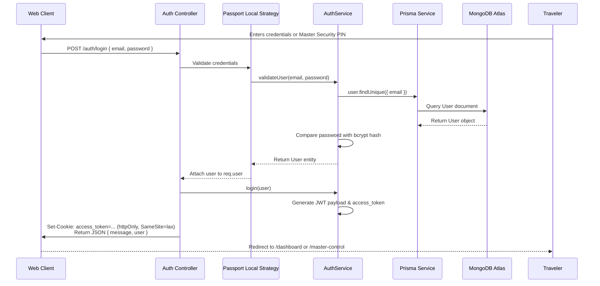
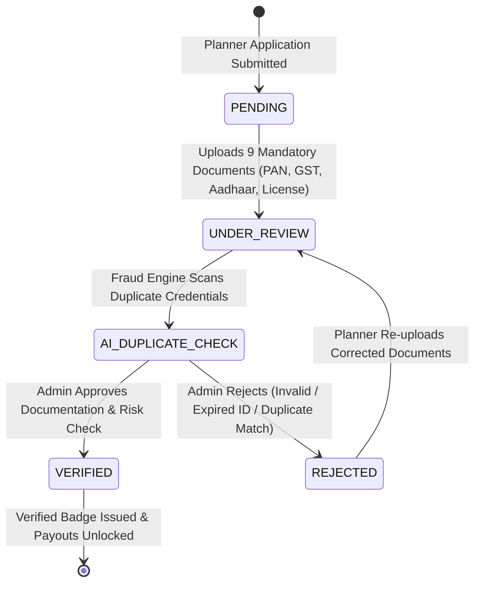

# 🏔️ Beacon - Next-Generation Travel Marketplace & Itinerary Ecosystem

Welcome to **Beacon**, an enterprise-grade platform that connects **Travelers** with specialized **Trip Organizers**, supported by a massive backend administration hub known as **Master Control**. Built using a high-performance modern tech stack, Beacon offers seamless itinerary booking, real-time trip operations tracking, and institutional-level risk management.

---

## 🏗️ Core Architecture & Tech Stack

### 🚀 Frontend Sub-Systems
* **Waypoint App (`apps/waypoint`)**: The primary React 19 + Vite SPA handling both consumer flows (Travelers & Planners) and the 14-module Master Admin Control Hub. Features heavy Framer Motion animations, Lucide icons, dynamic routing (React Router v7), and robust client-side validation (Zod + React Hook Form).
* **Next.js Web (`apps/web`)**: The secondary web presence built on Next.js App Router for high-performance SSR and SEO.

### ⚙️ Backend Services (`apps/api`)
* **NestJS Microservice Architecture**: Modular backend architecture utilizing NestJS (Express under the hood) built entirely in TypeScript.
* **Authentication**: Passport.js handling Local Strategies (Email/Password & Master Security PINs) and JWT (JSON Web Tokens) with strict HTTP-only cookies and CORS origin protection.
* **API Standardization**: Automated Swagger OpenAPI documentation, strict payload validation using `class-validator`, and global exception filters.

### 🗄️ Database Layer (`packages/database`)
* **ORM**: Prisma ORM providing end-to-end type safety and automated migration tracking.
* **Database Engine**: MongoDB (via MongoDB Atlas) modeling 15+ complex entities including Users, Bookings, Packages, Disputes, and Audit Logs.

---

## 🔒 Security & Verification Flows

### 1. Unified Authentication Pipeline

* **Firebase Google Authentication**: Integrated seamless Google Sign-In with forced account selection to prevent silent login failures.
* **Email & Password**: Streamlined signup and login flows with unified UI tabs and strict validation.



### 2. Planner Verification Vault & Verified Badge Pipeline

* **Secure Document Uploads**: Strictly enforced PDF-only uploads (Max 2MB) for KYC documents, preventing browser local storage quota crashes. Brand logos are restricted to images (Max 1MB).
* **Enhanced Form UX**: Replaced buggy brand auto-fills with blank defaults and introduced native `<datalist>` autocomplete for Indian States.
* **Master Submission**: Integrated "Submit to Master" logic with real-time success modals and hourly status refresh notifications.



---

## 🧩 Monorepo Codebase Structure

```
d:\Beacon
├── .env                       # Root environment variables configuration
├── package.json               # Root monorepo package setup & NPM workspace scripts
├── README.md                  # Comprehensive platform documentation
├── apps/                      # Monorepo Application Directory
│   ├── api/                   # NestJS REST API Backend
│   │   ├── src/
│   │   │   ├── main.ts        # Bootstrap entrypoint, dynamic port detection, CORS
│   │   │   ├── app.module.ts  # Main NestJS module aggregating all domain modules
│   │   │   └── auth/          # Auth Guards, Local & JWT Passport Strategies
│   │   └── package.json
│   │
│   ├── waypoint/              # Main Vite + React 19 Frontend & Master Command Hub
│   │   ├── src/
│   │   │   ├── App.tsx        # React Router v7 animated routing & Master Provider wrapper
│   │   │   ├── index.css      # Design tokens, custom scrollbars & glassmorphic styling
│   │   │   ├── components/
│   │   │   │   ├── dashboard/ # Planner & Traveler dashboard components
│   │   │   │   └── master/    # MasterControlLayout.tsx (Mission Control Frame & Top Bar)
│   │   │   ├── context/
│   │   │   │   ├── AuthContext.tsx       # User session state
│   │   │   │   └── MasterAdminContext.tsx# Reactive state store across all 14 admin modules
│   │   │   ├── data/
│   │   │   │   └── masterAdminData.ts    # Complete mock telemetry & domain datasets
│   │   │   ├── pages/
│   │   │   │   ├── master/    # 14 Enterprise Master Control Module Views
│   │   │   │   │   ├── MasterLoginPage.tsx
│   │   │   │   │   ├── MissionControlOverviewPage.tsx
│   │   │   │   │   ├── VerificationCenterPage.tsx
│   │   │   │   │   ├── UserManagementPage.tsx
│   │   │   │   │   ├── LiveTripOperationsPage.tsx
│   │   │   │   │   ├── PackageManagementPage.tsx
│   │   │   │   │   ├── BookingManagementPage.tsx
│   │   │   │   │   ├── PaymentCenterPage.tsx
│   │   │   │   │   ├── CustomerCareCenterPage.tsx
│   │   │   │   │   ├── DisputesReportsPage.tsx
│   │   │   │   │   ├── ReviewModerationPage.tsx
│   │   │   │   │   ├── MarketingAnnouncementsPage.tsx
│   │   │   │   │   ├── PlatformAnalyticsPage.tsx
│   │   │   │   │   ├── FraudAuditLogPage.tsx
│   │   │   │   │   └── PlatformSettingsPage.tsx
│   │   │   │   └── ... (Traveler & Organizer pages)
│   │   └── package.json
│   │
│   └── web/                   # Next.js 16 (App Router) Secondary Web Portal
│
└── packages/                  # Monorepo Shared Package Directory
    └── database/              # Shared Prisma & MongoDB Database Layer
        ├── prisma/
        │   └── schema.prisma  # Master Prisma Schema (15+ Data Models & Enums)
        └── index.ts           # Shared exports (@beacon/database)
```

---

## 📡 Comprehensive API & Portal Reference

### 🛸 Master Control Portal Routes (`apps/waypoint`)
| Endpoint Route | Module Name | Primary Administrative Capabilities |
| :--- | :--- | :--- |
| `/master-login` | **Master Login Portal** | 13-role selector, PIN entry, hardware key, biometric scan simulation |
| `/master-control` | **Mission Control Overview** | Live microservice health, executive KPIs, live event stream, threat alerts |
| `/master-control/verification` | **Verification Center** | 9-document audit drawer, duplicate PAN/GST detector, Verified Badge issuance |
| `/master-control/users` | **User Operations & RBAC** | Manage 1.2k+ planners, 48k+ customers, staff privileges, payout freezes |
| `/master-control/trips` | **Live Trip Operations** | Real-time departure monitoring, guide contact, vehicle info, satellite GPS map |
| `/master-control/packages` | **Package Management** | Quality score audit, AI duplicate text/image scanner, spotlight featuring |
| `/master-control/bookings` | **Booking Operations** | Search by Booking ID / UTR, lifecycle dossiers, tax invoices, full refunds |
| `/master-control/payments` | **Payment Center** | UTR verification ledger, duplicate UTR alerts, commission split calculator |
| `/master-control/support` | **Customer Care CRM** | CSAT metrics, response times, SLA countdowns, dual-channel chat desk |
| `/master-control/disputes` | **Disputes Tribunal** | Legal conflict resolution, evidence inspection, binding verdict rulings |
| `/master-control/reviews` | **Review Moderation** | Moderates customer ratings, flags defamation/spam IP clusters |
| `/master-control/marketing` | **Growth & Marketing** | Manages homepage banners, push broadcasts, festival promo campaigns |
| `/master-control/analytics` | **Executive Intelligence** | ABV metrics, retention cohorts, destination heatmaps, planner leaderboards |
| `/master-control/fraud-audit` | **Fraud & Audit Engine** | Immutable audit log table recording IP, actor, role, timestamps, state diffs |
| `/master-control/settings` | **Platform Settings** | Commission rates, GST tax %, minimum payouts, emergency lockdown switches |

---

## 🚀 Setup & Installation Guide

### Prerequisites
- **Node.js**: v20.0.0 or higher
- **NPM**: v10.0.0 or higher
- **MongoDB**: Access to a MongoDB Atlas cluster or local instance

### Step-by-Step Installation

1. **Clone the Repository**:
   ```bash
   git clone https://github.com/sawantyash07/Beacon.git
   cd Beacon
   ```

2. **Install Monorepo Dependencies**:
   ```bash
   npm install
   ```

3. **Generate Prisma Client**:
   ```bash
   npm run db:generate --workspace=@beacon/database
   ```

4. **Launch Application Workspaces**:
   ```bash
   # Run Vite React Frontend & Master Control Hub
   npm run dev:waypoint
   # Access Master Login at http://localhost:5173/master-login
   ```

---

## 🧪 Testing & Build Pipeline

```bash
# Build all monorepo applications and packages
npm run build

# Build waypoint client application
npm run build:waypoint
```

---

<p align="center">
  Built with ❤️ for adventurous travelers, passionate trip organizers, and enterprise platform administrators around the world.
</p>
