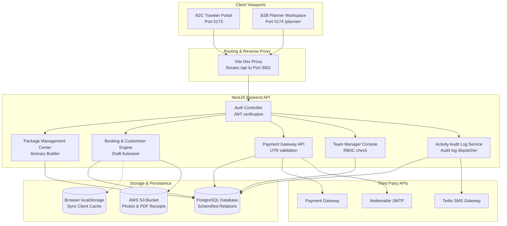
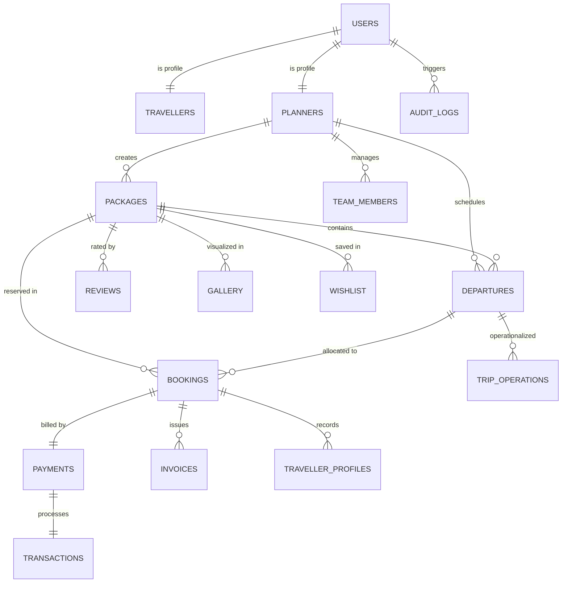
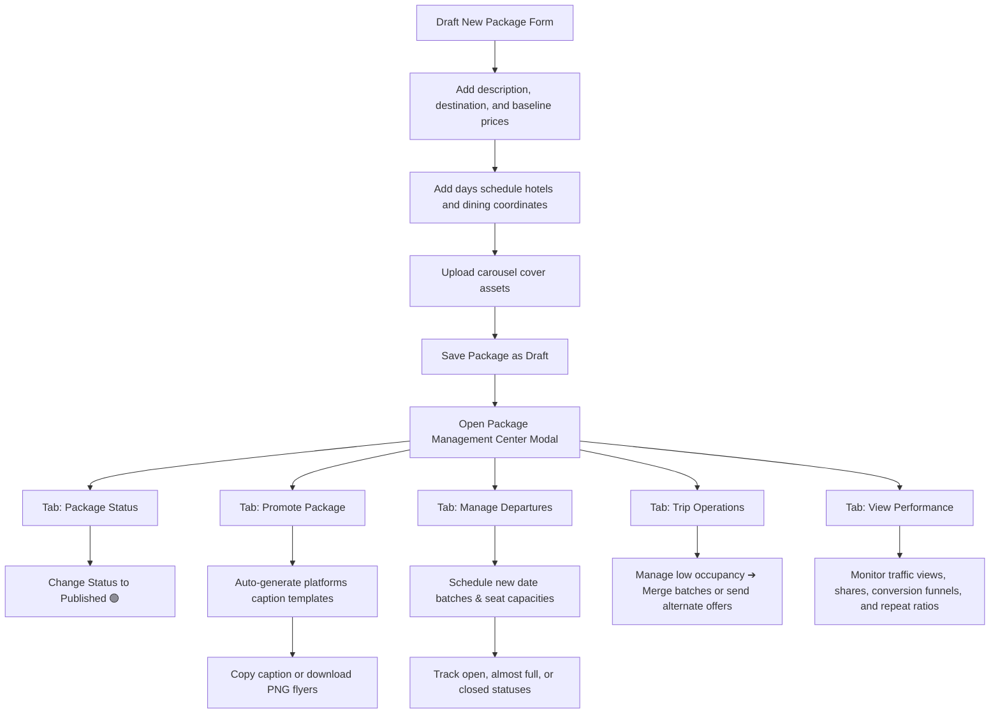

# 🧭 BEACON — Life Beyond Routine

<div align="center">


[](https://github.com/sawantyash07/Beacon/actions)
[](https://github.com/sawantyash07/Beacon/releases)
[](LICENSE)
[](https://github.com/sawantyash07/Beacon)
[](http://localhost:5173/)

**The Unified Business Operating System & Booking Marketplace for the Travel Industry**

[Explore B2C Portal](http://localhost:5173/) • [Access B2B Planner Workspace](http://localhost:5174/planner/) • [View API Docs](#api-documentation) • [Contribution Guide](#contributing-guide)

</div>

---

## 🗺️ Navigation Index

- [1. About Beacon](#-about-beacon)
  - [Problem Statement](#problem-statement)
  - [Solution Ecosystem](#solution-ecosystem)
  - [Long-Term Vision](#long-term-vision)
- [2. System Features Matrix](#-system-features-matrix)
  - [B2C Traveler Experience](#b2c-traveler-experience)
  - [B2B Planner Operations](#b2b-planner-operations)
  - [Platform Administration](#platform-administration)
- [3. Technology Stack](#-technology-stack)
- [4. Complete Project Architecture](#-complete-project-architecture)
- [5. Repository Folder Structure](#-repository-folder-structure)
- [6. Database Documentation & ERD](#-database-documentation--erd)
  - [Entity Relationship Diagram](#entity-relationship-diagram)
  - [Database Schemas Table Definitions](#database-schemas-table-definitions)
- [7. Core System Workflows](#-core-system-workflows)
  - [Authentication & JWT Exchange](#authentication--jwt-exchange)
  - [Traveler Booking & Payment Verification Lifecycle](#traveler-booking--payment-verification-lifecycle)
  - [Planner Package Creation & Operations Dispatch](#planner-package-creation--operations-dispatch)
- [8. API Documentation](#-api-documentation)
- [9. Frontend & Backend Documentation](#-frontend--backend-documentation)
- [10. Security & Performance Configurations](#-security--performance-configurations)
- [11. Installation & Deployment Guide](#-installation--deployment-guide)
- [12. Roadmap & Contribution Guide](#-roadmap--contribution-guide)

---

# ℹ️ About Beacon

### Problem Statement
The global travel and experience tourism sector is highly fragmented. While travelers seek unique, personalized itineraries, independent travel planners, tour leaders, and local coordinators struggle with operational chaos.
* **Spreadsheet Chaos**: Itineraries, schedules, and traveler checklists are scattered across disjointed spreadsheets, documents, and messaging apps.
* **Payment Friction**: Direct bank transfers and UPI payments require manual verification by the planner, causing delays and security risks.
* **Isolated Tools**: Booking builders, CRM trackers, invoice generators, marketing design utilities, and dispatch coordinators do not talk to each other.
* **Lack of Direct Channels**: Freelancers and small tour operators lack direct B2C channels to publish their itineraries, resulting in heavy reliance on high-commission agencies.

### Solution Ecosystem
Beacon acts as a complete business operating system and traveler marketplace. It brings together travelers, planners, and logistics providers onto a single platform:

```
┌────────────────────────────────────────────────────────┐
│                        BEACON                          │
├──────────────────────────┬─────────────────────────────┤
│      B2C Marketplace     │      B2B SaaS Workspace     │
│  (Customizers, Reviews,  │  (Itineraries, Analytics,   │
│   e-Receipts, Bookings)  │   Batch Seats, Operations)  │
└──────────────────────────┴─────────────────────────────┘
```

* **For Planners**: A comprehensive central dashboard to build itineraries, manage batch seat availability, coordinate drivers and guides, auto-verify client payments, generate branding PDFs, and track sales performance.
* **For Travelers**: A premium, responsive interface to discover local experiences, customize multi-passenger booking drafts, submit proof of payments, and download official receipts containing automatic GST/tax breakdowns.

### Long-Term Vision
Beacon is designed to scale from individual freelance guides managing single weekend trips to multi-department travel agencies managing thousands of departures. By automating financial verifications and team dispatch coordinates, Beacon frees travel companies to focus on what matters: delivering unforgettable journeys.

---

# ⚙️ System Features Matrix

<details>
<summary><b>💼 B2B Planner Workspace Features</b></summary>

* **Package Creator Dashboard**:
  * *Description*: Drag-and-drop package builder.
  * *Purpose*: Quickly build, save, and publish customizable travel programs.
  * *Benefits*: Standardized data storage for hotels, dining plans, custom transport grids, and maps coordinate locations.
  * *Workflow*: Planner adds destinations ➔ sets inclusions/exclusions ➔ drafts itinerary days ➔ publishes to marketplace.
* **Integrated Package Management Center**:
  * *Description*: Inline sidebar command panel replacing standard edit lists.
  * *Purpose*: Manage edit details, calendar departures, marketing flyers, and Visibility statuses (Published, Draft, Scheduled, Fully Booked, Cancelled, Archived) from one view.
  * *Benefits*: No screen jumping. Simulates B2C traveler journey previews in Mobile and Desktop viewports.
* **Seat Batch & Departure Control**:
  * *Description*: Interactive batch departure scheduler.
  * *Purpose*: Track booked/remaining seats, update deadlines, close registrations, or cancel specific runs.
  * *Benefits*: Automatic inventory locks preventing overbooking.
* **Promotion Hub**:
  * *Description*: Automatic content copy and template asset generator.
  * *Purpose*: Auto-formats travel titles, pricing rates, and inclusions for Instagram, WhatsApp, LinkedIn, Facebook, and Telegram.
  * *Benefits*: Single-click copy caption, link distribution, and downloadable PNG flyer assets.
* **Activity Audit Logs Feed**:
  * *Description*: Immutable logs documenting actions.
  * *Purpose*: Audit operations, ensuring complete traceability.
  * *Benefits*: Trace back edit changes, payment confirmations, and task assignment details.

</details>

<details>
<summary><b>✈️ B2C Traveler Experience Features</b></summary>

* **AI Matchmaker & Filter Engine**:
  * *Description*: Conversational travel questionnaire and search system.
  * *Purpose*: Matches traveler parameters (budget range, duration, activities, seasonal tab) with relevant planner items.
  * *Benefits*: High-fidelity interactive budget dual-slider tooltips and visual travel chips.
* **Multi-Step Customizer Wizard**:
  * *Description*: Five-step booking customizer.
  * *Purpose*: Allows editing adult/child traveler details, infant counts, cabin stays, meal configurations, and additional outings.
  * *Benefits*: Shaded card layouts and warning indicators for dietary modifications. Autosaves draft configurations.
* **E-Receipt Generator**:
  * *Description*: Immutable HTML + Canvas PDF invoice generator.
  * *Purpose*: Delivers immediate Tax Invoices (with agency CGST/SGST breakdowns) or Payment Receipts (for freelance hosts) upon booking verification.
  * *Benefits*: Saves snapshots to local storage, features download keys, and invokes mobile native share sheets.
* **Interactive Timeline Accordion**:
  * *Description*: Unified mobile schedule component.
  * *Purpose*: Combines high-level day timeline dots and expandable accordion day descriptions.
  * *Benefits*: Tapping a dot expands its details instantly in place. Includes day-by-day dining specifications.

</details>

<details>
<summary><b>🛠️ Administrative & Platform Controls</b></summary>

* **Verification Desk**: Verify incoming planner registrations, credential documents, tax information, and payment UTRs.
* **Dispute Resolver**: Arbitrates cancellations and refund allocations based on package policy records.
* **Platform Security Settings**: Global rate limits, JWT cookie configurations, and webhook logs.

</details>

---

# 💻 Technology Stack

| Layer | Technology | Version | Purpose |
| :--- | :--- | :--- | :--- |
| **Frontend Framework** | React (TSX / JSX) | `18.2.x` | Core client and dashboard interface engine. |
| **Styles Engine** | Vanilla CSS + TailwindCSS | `3.4.x` | Premium custom styling, glassmorphism templates, responsive grids. |
| **State Router** | React Router DOM | `6.x` | Multi-page routing, query mapping, dashboard workspaces. |
| **Build Tool** | Vite | `5.x` | Fast bundler, reverse proxy setup, hot-reload server. |
| **Animations** | Framer Motion | `11.x` | Scroll reveals, drawer slides, status modal transitions. |
| **Icons Library** | Lucide React | `0.344.x` | Sleek outline icons vector support. |
| **PDF Renderer** | html2pdf.js / html2canvas | `0.10.x` | Local canvas compilation to print E-receipts. |
| **Toaster Alerts** | Sonner | `1.4.x` | Interactive, lightweight notification toast banners. |
| **Server Runtime** | Node.js | `20.x` | High-efficiency backend service framework. |
| **API Server** | NestJS | `10.x` | Modular REST API architecture controller. |
| **Database** | PostgreSQL / MongoDB | `16.x / 7.x` | Structured data repository, indexes, schemas. |

---

# 🏗️ Complete Project Architecture



---

# 📁 Repository Folder Structure

```
beacon-travel-companion/ (B2C Workspace & Project Root)
├── .git/                        # Version control repository metadata
├── dist/                        # Compiled production assets for B2C client
├── css/
│   └── styles.css               # Main styling rules, responsive layout grids, and animations
├── js/
│   └── app.js                   # Client interactions: AI questionnaire, timeline accordion, checkout wizard
├── public/                      # Static resources
│   ├── favicon.ico              # Web asset favicon file to prevent CORB warning errors
│   └── planner/                 # Compiled target directory for B2B Planner Workspace bundle
├── package.json                 # Project execution script commands and developer configurations
├── vite.config.js               # B2C Vite development server configs and reverse proxies
└── Beacon/                      # B2B Planner Monorepo Workspace
    ├── package.json             # Workspace dependencies and monorepo workspace configurations
    └── apps/
        └── planner/             # Planner React App Directory
            ├── index.html       # Planner main HTML framework
            ├── vite.config.ts   # Port allocation configurations, aliases, and public build targets
            └── src/
                ├── App.tsx      # Main application router and lazy loading page lists
                ├── main.tsx     # React rendering initial bootstrap entrypoint
                ├── data/
                │   └── mockData.ts # Data arrays (packages, bookings, reviews, and team members list)
                ├── components/  # Shared dashboard widgets
                │   ├── ui/      # Core interface elements (Buttons, Cards, Badges, Skeletons)
                │   └── dashboard/ # Navigation components (Sidebar, Navbar, ImageGallery)
                ├── utils/       # Utility helpers (PDF brochure generators)
                └── pages/       # Workspace application page views
                    ├── LoginPage.tsx          # Credentials and mock auth triggers
                    ├── SignUpPage.tsx         # Account setup forms
                    └── dashboard/
                        ├── OverviewPage.tsx      # B2B Command console stats, pending verifications
                        ├── PackagesPage.tsx      # Unified Package Management Center dashboard
                        ├── TripOperationsPage.tsx # departures grids, merge systems, and refund controls
                        └── TeamManagementPage.tsx # Team stats, custom role permission matrix, activity feeds
```

---

# 🗄️ Database Documentation & ERD

## Entity Relationship Diagram



## Database Schemas Table Definitions

### 1. Users (`users`)
* **Purpose**: Base system accounts with credentials and roles.
* **Primary Key**: `id` (`UUID`, Auto-generated)
* **Columns**:
  * `email` (`VARCHAR(255)`, Unique, Indexed, Not Null)
  * `password_hash` (`VARCHAR(255)`, Not Null)
  * `base_role` (`ENUM('admin', 'planner', 'traveller')`, Not Null)
  * `is_verified` (`BOOLEAN`, Default: `false`)
  * `created_at` (`TIMESTAMP`, Default: `NOW()`)
* **Constraints**: Email must contain `@` symbol.

### 2. Travellers (`travellers`)
* **Purpose**: Profiles for travelers utilizing the booking engines.
* **Primary Key**: `id` (`UUID`, Auto-generated)
* **Foreign Key**: `user_id` (`UUID` references `users(id)` ON DELETE CASCADE)
* **Columns**:
  * `full_name` (`VARCHAR(100)`, Not Null)
  * `mobile_number` (`VARCHAR(20)`, Unique, Not Null)
  * `home_base` (`VARCHAR(100)`, Nullable)
  * `avatar_url` (`TEXT`, Nullable)
* **Indexes**: Unique index on `user_id`.

### 3. Planners (`planners`)
* **Purpose**: Profiles for travel coordinators and organizations.
* **Primary Key**: `id` (`UUID`, Auto-generated)
* **Foreign Key**: `user_id` (`UUID` references `users(id)` ON DELETE CASCADE)
* **Columns**:
  * `organization_name` (`VARCHAR(150)`, Not Null)
  * `model_type` (`ENUM('COMPANY', 'FREELANCER')`, Default: `'COMPANY'`)
  * `upi_id` (`VARCHAR(100)`, Not Null)
  * `gst_number` (`VARCHAR(15)`, Nullable)
  * `is_approved` (`BOOLEAN`, Default: `false`)

### 4. Packages (`packages`)
* **Purpose**: Travel packages and templates.
* **Primary Key**: `id` (`VARCHAR(50)`)
* **Foreign Key**: `planner_id` (`UUID` references `planners(id)` ON DELETE CASCADE)
* **Columns**:
  * `title` (`VARCHAR(255)`, Not Null, Indexed)
  * `destination` (`VARCHAR(100)`, Not Null, Indexed)
  * `duration_days` (`INTEGER`, Not Null)
  * `base_price` (`DECIMAL(12,2)`, Not Null)
  * `discount_percentage` (`INTEGER`, Default: `0`)
  * `status` (`VARCHAR(30)`, Default: `'draft'`, Indexed)
  * `inclusions` (`TEXT[]`)
  * `exclusions` (`TEXT[]`)

### 5. Departures (`departures`)
* **Purpose**: Specific calendar runs/batches for published packages.
* **Primary Key**: `id` (`UUID`, Auto-generated)
* **Foreign Key**: `package_id` (`VARCHAR(50)` references `packages(id)` ON DELETE CASCADE)
* **Columns**:
  * `departure_date` (`DATE`, Not Null, Indexed)
  * `total_capacity` (`INTEGER`, Not Null)
  * `booked_seats` (`INTEGER`, Default: `0`)
  * `booking_deadline` (`DATE`, Not Null)
  * `status` (`VARCHAR(30)`, Default: `'Open'`)
* **Constraints**: `booked_seats` <= `total_capacity`.

### 6. Bookings (`bookings`)
* **Purpose**: Purchase records and customization states.
* **Primary Key**: `id` (`VARCHAR(50)`)
* **Foreign Keys**:
  * `package_id` (`VARCHAR(50)` references `packages(id)`)
  * `departure_id` (`UUID` references `departures(id)`)
  * `traveller_id` (`UUID` references `travellers(id)`)
* **Columns**:
  * `total_price` (`DECIMAL(12,2)`, Not Null)
  * `status` (`ENUM('draft', 'payment_pending', 'confirmed', 'cancelled')`, Default: `'draft'`)
  * `stay_upgrade_applied` (`BOOLEAN`, Default: `false`)
  * `meal_plan_preference` (`VARCHAR(50)`, Nullable)

### 7. Payments (`payments`)
* **Purpose**: Billing, verification status, and invoice relationships.
* **Primary Key**: `id` (`UUID`, Auto-generated)
* **Foreign Key**: `booking_id` (`VARCHAR(50)` references `bookings(id)` ON DELETE CASCADE)
* **Columns**:
  * `amount` (`DECIMAL(12,2)`, Not Null)
  * `payment_mode` (`VARCHAR(50)`, Default: `'UPI'`)
  * `utr_code` (`VARCHAR(50)`, Unique, Not Null, Indexed)
  * `status` (`ENUM('pending_verification', 'verified', 'declined')`, Default: `'pending_verification'`)

### 8. Transactions (`transactions`)
* **Purpose**: Ledger logging all platform credit/debit movements.
* **Primary Key**: `id` (`UUID`, Auto-generated)
* **Foreign Key**: `payment_id` (`UUID` references `payments(id)`)
* **Columns**:
  * `ledger_type` (`ENUM('credit', 'debit', 'payout', 'refund')`, Not Null)
  * `amount` (`DECIMAL(12,2)`, Not Null)
  * `transaction_timestamp` (`TIMESTAMP`, Default: `NOW()`)

### 9. Reviews (`reviews`)
* **Purpose**: Traveler feedback scores and replies.
* **Primary Key**: `id` (`UUID`, Auto-generated)
* **Foreign Keys**:
  * `package_id` (`VARCHAR(50)` references `packages(id)`)
  * `traveller_id` (`UUID` references `travellers(id)`)
* **Columns**:
  * `rating_score` (`INTEGER`, Not Null)
  * `comment_text` (`TEXT`, Nullable)
  * `planner_reply` (`TEXT`, Nullable)

### 10. Gallery (`gallery`)
* **Purpose**: Media photo strings linked to package models.
* **Primary Key**: `id` (`UUID`, Auto-generated)
* **Foreign Key**: `package_id` (`VARCHAR(50)` references `packages(id)`)
* **Columns**:
  * `image_url` (`TEXT`, Not Null)

### 11. Wishlist (`wishlist`)
* **Purpose**: Saved lists for traveler bookmarks.
* **Primary Key**: `id` (`UUID`, Auto-generated)
* **Foreign Keys**:
  * `traveller_id` (`UUID` references `travellers(id)`)
  * `package_id` (`VARCHAR(50)` references `packages(id)`)

### 12. Marketing Campaigns (`marketing_campaigns`)
* **Purpose**: Promotion details and QR codes.
* **Primary Key**: `id` (`UUID`, Auto-generated)
* **Foreign Key**: `package_id` (`VARCHAR(50)` references `packages(id)`)
* **Columns**:
  * `campaign_name` (`VARCHAR(150)`, Not Null)
  * `platform` (`VARCHAR(50)`, Not Null)
  * `clicks_count` (`INTEGER`, Default: `0`)

### 13. Coupons (`coupons`)
* **Purpose**: Discount code validation parameters.
* **Primary Key**: `code` (`VARCHAR(30)`)
* **Columns**:
  * `discount_value` (`DECIMAL(10,2)`, Not Null)
  * `is_percentage` (`BOOLEAN`, Default: `true`)
  * `expiry_date` (`DATE`, Not Null)

### 14. Notifications (`notifications`)
* **Purpose**: Event-driven alerts.
* **Primary Key**: `id` (`UUID`, Auto-generated)
* **Foreign Key**: `user_id` (`UUID` references `users(id)`)
* **Columns**:
  * `alert_title` (`VARCHAR(255)`, Not Null)
  * `message_body` (`TEXT`, Not Null)
  * `is_read` (`BOOLEAN`, Default: `false`)

### 15. Messages (`messages`)
* **Purpose**: Real-time chat threads inside workspaces.
* **Primary Key**: `id` (`UUID`, Auto-generated)
* **Columns**:
  * `conversation_id` (`VARCHAR(100)`, Not Null, Indexed)
  * `sender_id` (`UUID`, Not Null)
  * `message_text` (`TEXT`, Not Null)
  * `sent_at` (`TIMESTAMP`, Default: `NOW()`)

### 16. Support Tickets (`support_tickets`)
* **Purpose**: Client help desk tickets.
* **Primary Key**: `id` (`UUID`, Auto-generated)
* **Foreign Key**: `user_id` (`UUID` references `users(id)`)
* **Columns**:
  * `subject` (`VARCHAR(200)`, Not Null)
  * `status` (`VARCHAR(30)`, Default: `'Open'`)

### 17. Invoices (`invoices`)
* **Purpose**: PDF invoices and receipts storage metadata.
* **Primary Key**: `id` (`UUID`, Auto-generated)
* **Foreign Key**: `booking_id` (`VARCHAR(50)` references `bookings(id)`)
* **Columns**:
  * `invoice_number` (`VARCHAR(100)`, Unique, Not Null, Indexed)
  * `invoice_url` (`TEXT`, Not Null)
  * `pdf_snapshot` (`TEXT`, Not Null)

### 18. Documents (`documents`)
* **Purpose**: Planner credentials documents.
* **Primary Key**: `id` (`UUID`, Auto-generated)
* **Foreign Key**: `planner_id` (`UUID` references `planners(id)`)
* **Columns**:
  * `document_name` (`VARCHAR(150)`)
  * `document_url` (`TEXT`)

### 19. OTP Verification (`otp_verification`)
* **Purpose**: Single use codes for authentication.
* **Primary Key**: `id` (`UUID`, Auto-generated)
* **Columns**:
  * `recipient` (`VARCHAR(100)`, Not Null)
  * `otp_hash` (`VARCHAR(255)`, Not Null)
  * `expires_at` (`TIMESTAMP`, Not Null)

### 20. Verification Records (`verification_records`)
* **Purpose**: Compliance logs.
* **Primary Key**: `id` (`UUID`, Auto-generated)
* **Columns**:
  * `entity_type` (`VARCHAR(50)`)
  * `status` (`VARCHAR(50)`)

### 21. Analytics Stats (`analytics_stats`)
* **Purpose**: Page hits and clicks caches.
* **Primary Key**: `id` (`UUID`, Auto-generated)
* **Foreign Key**: `package_id` (`VARCHAR(50)` references `packages(id)`)
* **Columns**:
  * `views_count` (`INTEGER`, Default: `0`)
  * `shares_count` (`INTEGER`, Default: `0`)

### 22. Trip Operations (`trip_operations`)
* **Purpose**: Dispatch and logs for departures.
* **Primary Key**: `id` (`UUID`, Auto-generated)
* **Foreign Key**: `departure_id` (`UUID` references `departures(id)`)
* **Columns**:
  * `assigned_guide` (`VARCHAR(100)`)
  * `assigned_transport` (`VARCHAR(100)`)
  * `checklist_json` (`JSONB`)

### 23. Admins (`admins`)
* **Purpose**: System admin logins.
* **Primary Key**: `id` (`UUID`, Auto-generated)
* **Foreign Key**: `user_id` (`UUID` references `users(id)`)

### 24. Global Settings (`global_settings`)
* **Purpose**: Configuration maps.
* **Primary Key**: `key` (`VARCHAR(100)`)
* **Columns**:
  * `value` (`TEXT`)

### 25. Activity Logs (`audit_logs`)
* **Purpose**: Audit trails tracking team actions.
* **Primary Key**: `id` (`UUID`, Auto-generated)
* **Foreign Key**: `user_id` (`UUID` references `users(id)`)
* **Columns**:
  * `action_description` (`TEXT`, Not Null)
  * `module_name` (`VARCHAR(100)`, Not Null)
  * `ip_address` (`VARCHAR(45)`)
  * `timestamp` (`TIMESTAMP`, Default: `NOW()`)

---

# 🔐 Core System Workflows

## Authentication & JWT Exchange

```mermaid
sequenceDiagram
    autonumber
    actor User as Client App
    participant Auth as Auth Service
    participant DB as PostgreSQL
    
    User->>Auth: POST /api/auth/login (email, password)
    Auth->>DB: query hash where email = input
    DB-->>Auth: password_hash, user_role
    Auth->>Auth: bcrypt.compare(input, hash)
    
    rect rgb(7, 24, 46)
        Note over Auth: Generate Dual Token Pair
        Auth->>Auth: Sign AccessToken (JWT exp: 15m)
        Auth->>Auth: Sign RefreshToken (JWT exp: 7d)
    end
    
    Auth->>DB: save token fingerprint to refresh_tokens
    Auth-->>User: HttpOnly Set-Cookie: refresh_token; Body: access_token, user_profile
    
    Note over User, Auth: Submitting resource requests using Bearer AccessToken
    
    User->>Auth: GET /api/dashboard (Headers: Bearer access_token)
    Auth-->>User: 200 OK (Protected Workspace Data)
```

## Traveler Booking & Payment Verification Lifecycle

```mermaid
sequenceDiagram
    autonumber
    actor Traveler as Traveler (B2C)
    participant App as app.js (Interaction Controller)
    participant Planner as OverviewPage.tsx (B2B Planner Command)
    participant Local as localStorage DB
    
    Traveler->>App: Submits Customization (adult/stay/meal)
    App->>Local: save draft state (status: "draft")
    App-->>Traveler: Render Incomplete checklist & Resume option
    
    Traveler->>App: Taps "Initiate Payment"
    App->>App: Generates UPI Intent Link & Mock QR Code
    Traveler->>App: Submits Transaction UTR Code
    App->>Local: update state (status: "payment_pending")
    
    rect rgb(7, 32, 60)
        Note over Planner: Planner Dashboard Update
        Planner->>Local: Listen for "payment_pending" events
        Planner->>Planner: Alert: Approve Payment (with UTR details)
        Planner->>Planner: Clicks "Approve Payment"
    end
    
    Planner->>Local: update state (status: "confirmed")
    Local-->>App: Event Listener fires state change
    App->>App: Lock pricing & reveal invoice download options
    App->>App: Render PDF E-Receipt (Tax Invoice / standard transaction receipt)
```



## Planner Package Creation & Operations Dispatch



---

# 🔌 API Documentation

### 1. Authenticate user
* **Method**: `POST`
* **Endpoint**: `/api/auth/login`
* **Authentication**: None
* **Request Body**:
```json
{
  "email": "planner@beacon.com",
  "password": "SecurePassword123"
}
```
* **Success Response (Code: `200 OK`)**:
```json
{
  "access_token": "eyJhbGciOiJIUzI1NiIsInR5cCI6IkpXVCJ9...",
  "user": {
    "id": "890ba12-fbc9-42b1-9122-38d7211",
    "email": "planner@beacon.com",
    "role": "planner"
  }
}
```
* **Error Response (Code: `401 Unauthorized`)**:
```json
{
  "message": "Invalid login credentials provided.",
  "error": "Unauthorized"
}
```

### 2. Save Package Draft
* **Method**: `POST`
* **Endpoint**: `/api/packages`
* **Authentication**: Bearer AccessToken
* **Request Body**:
```json
{
  "title": "Maldives Paradise Escape",
  "destination": "Maldives",
  "price": 2499,
  "discount": 10,
  "inclusions": ["Flights", "Hotel", "Breakfast"],
  "exclusions": ["Personal expenses"]
}
```
* **Success Response (Code: `201 Created`)**:
```json
{
  "id": "PKG-001",
  "status": "draft",
  "title": "Maldives Paradise Escape",
  "created_at": "2026-08-01T15:00:00Z"
}
```

### 3. Verify Payment UTR code
* **Method**: `POST`
* **Endpoint**: `/api/payments/verify`
* **Authentication**: Bearer AccessToken
* **Request Body**:
```json
{
  "booking_id": "BKG-7821",
  "utr_code": "UTR78129038"
}
```
* **Success Response (Code: `200 OK`)**:
```json
{
  "payment_id": "8902ba1-382a-bc91-231a-de89a123",
  "status": "verified",
  "amount_verified": 2249.10
}
```

---

# 💻 Frontend & Backend Documentation

### Frontend Architecture
Beacon Planner is constructed as a React Single Page Application (SPA).
* **Router Management (`App.tsx`)**: Lazy loads core panels (OverviewPage, PackagesPage, TeamManagementPage, TripOperationsPage) to improve initial page load performance.
* **Layout Wrappers (`DashboardLayout.tsx`)**: Integrates responsive sidebar elements, theme configurations, notifications overlays, and handles clean state cleanup on exit.
* **Local Caches Engine**: Synchronizes state variables with `localStorage` (via keys like `beacon_planner_packages` and `beacon_bookings`), facilitating instant coordination between the traveler catalog views and the planner creation desk.

### Backend Controllers & Services
* **Controllers**: Handles endpoint routing, extracts request parameters, and runs schema-level validators.
* **Services**: Houses all business logic. For example, calculating price differences for package upgrades, merging travelers into alternative departures, and dispatching audit log transactions.
* **Middlewares**: Enforces security constraints:
  * Verification check: decrypts JWT cookies and extracts role parameters.
  * RBAC controller: cross-references the user's role against permissions to deny unauthorized actions (e.g. Sales Executives trying to trigger refunds).

---

# 🛡️ Security & Performance Configurations

### Security Implementations
* **Granular Role-Based Access Controls (RBAC)**: Supports custom permissions. Tapping "Create Custom Role" allows building a custom permissions checklist, saving permissions explicitly to prevent access privilege leakage.
* **Credential Safety**: Password encryption via `bcrypt` (12 salt rounds).
* **Input Sanitization**: Implements Helmet headers to disable unsafe cross-origin iframe injections and mitigates XSS/SQL Injection risks.
* **Security Lockouts**: System validation prevents removing the last Owner of a travel agency.

### Performance Optimizations
* **Bundle Splitting**: Code-splitting ensures users only fetch code needed for their active dashboard page.
* **Image Delivery**: Utilizes dynamic Unsplash optimization queries (`w=600&q=80`) for photo assets to maintain fast page load times.
* **Autosave Backups**: Intermediate booking details are saved directly in local database buckets, preventing data loss during network disruptions.

---

# 🚀 Installation & Deployment Guide

### System Prerequisites
* Node.js (version 20 or higher)
* git CLI tools

### Local Installation Steps

1. Clone the project repository:
   ```bash
   git clone https://github.com/sawantyash07/Beacon.git
   cd Beacon
   ```

2. Initialize and download dependencies for both workspaces:
   ```bash
   # Install parent B2C assets builder
   npm install
   
   # Navigate into B2B Monorepo and install packages
   cd Beacon
   npm install
   ```

3. Setup environment configuration variables. Copy the sample variables:
   ```bash
   cp .env.example .env
   ```

4. Boot the development servers:
   ```bash
   # Start the B2C customer portal dev server
   cd ..
   npm run dev
   
   # Start the B2B planner dashboard dev server (in a separate terminal)
   cd Beacon
   npm run dev:planner
   ```

### Production Bundling
Compile and build static distribution files for hosting platforms:
```bash
# Bundle Waypoint workspace assets
npm run build:planner

# Bundle root B2C customer-facing files
npm run build
```

---

# 📋 Roadmap & Contribution Guide

### Future Development Scope
* **AI Matchmaker Integration**: Intelligent chatbot generating personalized itinerary drafts from natural language inputs.
* **Live GPS Tracking**: Real-time traveler tracking and map checks for coordinators.
* **Predictive Dynamic Pricing**: Automatic baseline price updates based on seasonal demand trends.

### Production Release Timeline
* **Phase 1**: Custom Booking Wizard, timeline timelines, and layout updates. (Completed)
* **Phase 2**: Launch B2B Planner dashboard monorepo and packages synchronization. (Completed)
* **Phase 3**: Package Management Center and Team Management modules implementation. (Completed)
* **Phase 4**: Native Android/iOS applications wrappers setup and international payment checkouts. (Planned)

### Contributing Guide
1. Fork the project repository on GitHub.
2. Create a feature branch: `git checkout -b feature/AmazingFeature`
3. Commit your changes: `git commit -m 'Add some AmazingFeature'`
4. Push to the branch: `git push origin feature/AmazingFeature`
5. Open a Pull Request for code review and automated build testing.

---

## 📜 License
This project is licensed under the MIT License - see the [LICENSE](LICENSE) file for details.

## 📧 Contacts
* **Core Repository**: [https://github.com/sawantyash07/Beacon](https://github.com/sawantyash07/Beacon)
* **Project Dashboard**: [http://localhost:5174/planner/](http://localhost:5174/planner/)
* **Contact Email**: concierge@beaconplanner.com
