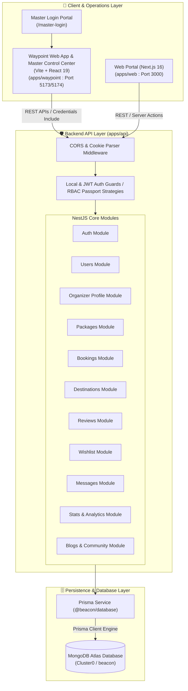
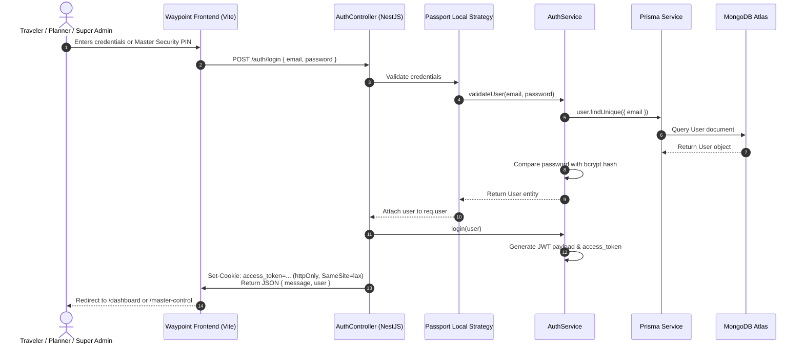
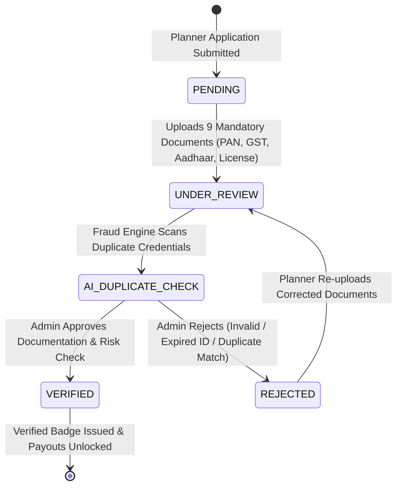

# 🏔️ Beacon - Next-Generation Travel Marketplace & Itinerary Ecosystem

[](https://github.com/sawantyash07/Beacon)
[](https://nodejs.org)
[](https://nestjs.com)
[](https://react.dev)
[](https://nextjs.org)
[](https://www.typescriptlang.org)
[](https://www.prisma.io)
[](https://www.mongodb.com)
[](https://tailwindcss.com)

**Beacon** is an enterprise-grade, end-to-end travel marketplace monorepo platform designed to connect adventurous travelers with verified travel planners, boutique agency operators, independent expedition leaders ("Organizers"), and platform super administrators.

Whether creating custom multi-day itineraries, hosting group trips, tracking booking status, verifying business documentation, facilitating real-time traveler-planner messaging, or managing platform-wide operational health from Mission Control, Beacon provides a seamless experience for all travel industry stakeholders.

---

## 📋 Table of Contents

- [🌟 System Overview & Core Capabilities](#-system-overview--core-capabilities)
- [🛸 Master Command Hub (Super Admin Portal)](#-master-command-hub-super-admin-portal)
- [🛠️ Technology Stack](#️-technology-stack)
- [🏗️ High-Level System Architecture](#️-high-level-system-architecture)
- [🔄 Data & Request Flow Diagrams](#-data--request-flow-diagrams)
- [🧩 Monorepo Codebase Structure](#-monorepo-codebase-structure)
- [📦 Module Responsibilities & Component Interaction](#-module-responsibilities--component-interaction)
- [🗄️ Database & Schema Design](#️-database--schema-design)
- [🔐 Authentication & Authorization Architecture](#-authentication--authorization-architecture)
- [📡 Comprehensive API & Portal Reference](#-comprehensive-api--portal-reference)
- [🎯 Key Design Decisions & Engineering Strategy](#-key-design-decisions--engineering-strategy)
- [⚙️ Environment Variables & Configuration](#️-environment-variables--configuration)
- [🚀 Setup & Installation Guide](#-setup--installation-guide)
- [🧪 Testing, Build & Deployment Pipeline](#-testing-build--deployment-pipeline)
- [🤝 Contribution Guidelines](#-contribution-guidelines)

---

## 🌟 System Overview & Core Capabilities

Beacon solves the fragmentation in experiential travel planning by acting as a unified platform for all sides of the marketplace:

### 🧳 For Travelers
- **Explore & Filter Expeditions**: Search travel packages by destination, difficulty level (`EASY`, `MODERATE`, `HARD`, `EXPERT`), duration, price, and category.
- **Interactive Day-by-Day Itineraries**: View granular daily schedules, activity lists, meal inclusions, hotel details, and geographical mapping coordinates.
- **Direct Trip Booking**: Simple checkout process with passenger count selection, date picking, total calculation, and payment status updates.
- **Wishlist & Favorites**: Save packages for future trips.
- **Reviews & Ratings**: Share feedback and ratings for packages and destinations.
- **Direct Messaging**: Communicate directly with verified trip planners and organizers before and after booking.

### 🧭 For Travel Planners & Organizers (Company & Freelancers)
- **Multi-Section Organizer Hub**: 10-section profile manager covering basic info, travel expertise, operating locations, business credentials, active services, availability SLA, banking, social links, preferences, and security settings.
- **Verification Vault**: Upload official credentials (Govt ID, PAN, GST, Business Registration, Tourism License) with status tracking (`PENDING` -> `UNDER_REVIEW` -> `VERIFIED` / `REJECTED`).
- **Visual Package Builder**: Multi-step package editor allowing organizers to configure pricing, day-by-day itineraries, inclusions/exclusions, cover photos, and gallery images.
- **Booking & Lead Management**: Monitor incoming bookings, update booking states (`PENDING`, `CONFIRMED`, `CANCELLED`), track payments, and capture inquiries.
- **Interactive Performance Analytics**: Real-time charts for monthly revenue breakdown, package conversion rates, customer ratings, and traveler demographics.

---

## 🛸 Master Command Hub (Super Admin Portal)

The **Beacon Master Login & Mission Control Center** serves as the central operational brain for the entire nationwide platform, functioning similarly to enterprise products like Stripe Dashboard, Shopify Admin, Linear, and Vercel.

### 🔐 Zero-Trust Master Authentication (`/master-login`)
- **Multi-Role Persona Selection**: Support for 13 administrative roles including Super Admin, CEO, Operations Head, Verification Manager, Finance Manager, Customer Care Manager, Legal & Compliance Officer, and Marketing Manager.
- **Security Protocols**: 6-digit Master Security PIN, YubiKey hardware token integration, WebAuthn biometric passkey simulation, and real-time IP/TLS security badges.
- **Quick Demo Bypass**: Single-click access for rapid testing.

### 🛰️ 14 Operational Operations Modules (`/master-control/*`)

1. **Mission Control Overview**: Real-time 9-microservice health telemetry (APIs, Edge Nodes, DB, S3 Storage, Razorpay, Google Maps API, Email/SMS), 11 KPI metrics, auto-updating live event activity stream, intelligent threat alert panel, and emergency action bar.
2. **Verification Center (Beacon Trust Engine)**: Strict 9-point document audit (Aadhaar, PAN Card, GST Certificate, Business Registration, Tourism License, Bank Passbook, Address Proof, Logo, Photos). Features duplicate PAN/GST detector, risk score calculator, internal notes, and Verified Badge issuance.
3. **User Operations & RBAC Matrix**: Manages 1,240+ planners, 48,900+ customers, and internal staff. Includes profile dossiers, payout freeze toggles, customer blacklisting, JSON data exporters, and role privilege matrices.
4. **Live Trip Operations Center**: Real-time monitoring of active departures across India/world. Tracks assigned vehicles, tour guide contacts, occupancy %, complaints, and interactive satellite GPS coordinate map.
5. **Package Management & Quality Audit**: Categorizes packages (Drafts, Published, Hidden, Archived, Reported, Trending, Duplicate, Featured). Features quality score rating (0-100), AI duplicate text/image scanner, and policy violation removal.
6. **Booking Operations**: Multi-parameter search by Booking ID, UTR, traveller name, planner, or destination. Full lifecycle inspection, tax invoice download, and refund processing.
7. **Payment Center & Financial Command**: Financial ledger with UTR verification, duplicate UTR alerts, gateway transaction split (Razorpay/UPI), settlement queue, and live commission split calculator (8% - 15%).
8. **Customer Care CRM & Support Desk**: CSAT metrics (4.8/5), 12-minute response time tracking, SLA countdowns, and dual-channel message desk to reply to customers and planners.
9. **Reports & Disputes Tribunal**: Legal conflict resolution workspace for fraud, refund disputes, safety incidents, and package misrepresentation. Enables issuing binding legal rulings.
10. **Review Moderation**: Moderates customer ratings, flags defamation/spam IP clusters, and manages review visibility.
11. **Growth & Marketing**: Manages homepage banners, push broadcasts, festival campaigns, and conversion analytics.
12. **Executive Intelligence & Analytics**: Average Booking Value (ABV), repeat customer retention cohorts, destination popularity heatmaps, and planner leaderboards.
13. **Fraud Engine & Audit Logs**: Immutable audit log table recording actor, role, IP address, action, module, before/after diffs, and timestamp. AI risk rule evaluations.
14. **Platform Settings & Engine**: Configures commission rates, GST tax %, minimum payout thresholds, API key integrations, and emergency lockdown toggles.

---

## 🛠️ Technology Stack

| Layer | Tech / Tool | Description |
| :--- | :--- | :--- |
| **Monorepo Management** | **NPM Workspaces** | Native Node.js monorepo workspace orchestration (`apps/*`, `packages/*`) |
| **Backend API Framework** | **NestJS 11** | Scalable, modular TypeScript server framework with Dependency Injection |
| **Database ORM** | **Prisma 6** | Type-safe ORM connecting to MongoDB Atlas with auto-generated types |
| **Database** | **MongoDB Atlas** | NoSQL document database optimized for complex itinerary sub-documents |
| **Authentication** | **Passport.js & JWT** | Dual Passport Local & JWT strategy with HTTP-Only cookie delivery & password hashing via `bcrypt` |
| **Client Application** | **React 19 + Vite 8** | `apps/waypoint` - High-performance React SPA with React Router v7 & TailwindCSS v4 |
| **Super Admin Command Center** | **React 19 + Framer Motion** | `apps/waypoint` - Master Control Hub, 14 operational modules & reactive state store |
| **Web Portal Application** | **Next.js 16** | `apps/web` - React 19 App Router framework for SSR portal features |
| **UI Components & Styling** | **TailwindCSS v4, Lucide Icons, Framer Motion, Sonner** | Dark theme aesthetics, glassmorphism, cyan/electric blue accents, micro-animations, toast notifications |
| **Charts & Data Viz** | **Recharts** | Dynamic analytics charts for organizer dashboard & executive business intelligence |
| **Form Validation** | **React Hook Form & Zod** | Schema-driven form handling and robust data validation |

---

## 🏗️ High-Level System Architecture

Beacon is organized into a clean monorepo architecture separating backend micro-services/REST APIs, client single-page applications (SPA), server-rendered web portals, and shared database domain logic.



---

## 🔄 Data & Request Flow Diagrams

### 1. Authentication & JWT Cookie Flow

The authentication system employs Passport Local Strategy for login validation and issues a secure `httpOnly` JWT cookie for session maintenance across the client applications.



### 2. Planner Verification Vault & Verified Badge Pipeline



---

## 🧩 Monorepo Codebase Structure

```
d:\Beacon
├── .env                       # Root environment variables configuration
├── package.json               # Root monorepo package setup & NPM workspace scripts
├── README.md                  # Comprehensive platform documentation
├── apps/                      # Monorepo Application Directory
│   ├── api/                   # NestJS REST API Backend
│   │   ├── src/
│   │   │   ├── main.ts        # Bootstrap entrypoint, dynamic port detection, CORS
│   │   │   ├── app.module.ts  # Main NestJS module aggregating all domain modules
│   │   │   └── auth/          # Auth Guards, Local & JWT Passport Strategies
│   │   └── package.json
│   │
│   ├── waypoint/              # Main Vite + React 19 Frontend & Master Command Hub
│   │   ├── src/
│   │   │   ├── App.tsx        # React Router v7 animated routing & Master Provider wrapper
│   │   │   ├── index.css      # Design tokens, custom scrollbars & glassmorphic styling
│   │   │   ├── components/
│   │   │   │   ├── dashboard/ # Planner & Traveler dashboard components
│   │   │   │   └── master/    # MasterControlLayout.tsx (Mission Control Frame & Top Bar)
│   │   │   ├── context/
│   │   │   │   ├── AuthContext.tsx       # User session state
│   │   │   │   └── MasterAdminContext.tsx# Reactive state store across all 14 admin modules
│   │   │   ├── data/
│   │   │   │   └── masterAdminData.ts    # Complete mock telemetry & domain datasets
│   │   │   ├── pages/
│   │   │   │   ├── master/    # 14 Enterprise Master Control Module Views
│   │   │   │   │   ├── MasterLoginPage.tsx
│   │   │   │   │   ├── MissionControlOverviewPage.tsx
│   │   │   │   │   ├── VerificationCenterPage.tsx
│   │   │   │   │   ├── UserManagementPage.tsx
│   │   │   │   │   ├── LiveTripOperationsPage.tsx
│   │   │   │   │   ├── PackageManagementPage.tsx
│   │   │   │   │   ├── BookingManagementPage.tsx
│   │   │   │   │   ├── PaymentCenterPage.tsx
│   │   │   │   │   ├── CustomerCareCenterPage.tsx
│   │   │   │   │   ├── DisputesReportsPage.tsx
│   │   │   │   │   ├── ReviewModerationPage.tsx
│   │   │   │   │   ├── MarketingAnnouncementsPage.tsx
│   │   │   │   │   ├── PlatformAnalyticsPage.tsx
│   │   │   │   │   ├── FraudAuditLogPage.tsx
│   │   │   │   │   └── PlatformSettingsPage.tsx
│   │   │   │   └── ... (Traveler & Organizer pages)
│   │   └── package.json
│   │
│   └── web/                   # Next.js 16 (App Router) Secondary Web Portal
│
└── packages/                  # Monorepo Shared Package Directory
    └── database/              # Shared Prisma & MongoDB Database Layer
        ├── prisma/
        │   └── schema.prisma  # Master Prisma Schema (15+ Data Models & Enums)
        └── index.ts           # Shared exports (@beacon/database)
```

---

## 📡 Comprehensive API & Portal Reference

### 🛸 Master Control Portal Routes (`apps/waypoint`)
| Endpoint Route | Module Name | Primary Administrative Capabilities |
| :--- | :--- | :--- |
| `/master-login` | **Master Login Portal** | 13-role selector, PIN entry, hardware key, biometric scan simulation |
| `/master-control` | **Mission Control Overview** | Live microservice health, executive KPIs, live event stream, threat alerts |
| `/master-control/verification` | **Verification Center** | 9-document audit drawer, duplicate PAN/GST detector, Verified Badge issuance |
| `/master-control/users` | **User Operations & RBAC** | Manage 1.2k+ planners, 48k+ customers, staff privileges, payout freezes |
| `/master-control/trips` | **Live Trip Operations** | Real-time departure monitoring, guide contact, vehicle info, satellite GPS map |
| `/master-control/packages` | **Package Management** | Quality score audit, AI duplicate text/image scanner, spotlight featuring |
| `/master-control/bookings` | **Booking Operations** | Search by Booking ID / UTR, lifecycle dossiers, tax invoices, full refunds |
| `/master-control/payments` | **Payment Center** | UTR verification ledger, duplicate UTR alerts, commission split calculator |
| `/master-control/support` | **Customer Care CRM** | CSAT metrics, response times, SLA countdowns, dual-channel chat desk |
| `/master-control/disputes` | **Disputes Tribunal** | Legal conflict resolution, evidence inspection, binding verdict rulings |
| `/master-control/reviews` | **Review Moderation** | Moderates customer ratings, flags defamation/spam IP clusters |
| `/master-control/marketing` | **Growth & Marketing** | Manages homepage banners, push broadcasts, festival promo campaigns |
| `/master-control/analytics` | **Executive Intelligence** | ABV metrics, retention cohorts, destination heatmaps, planner leaderboards |
| `/master-control/fraud-audit` | **Fraud & Audit Engine** | Immutable audit log table recording IP, actor, role, timestamps, state diffs |
| `/master-control/settings` | **Platform Settings** | Commission rates, GST tax %, minimum payouts, emergency lockdown switches |

---

## 🚀 Setup & Installation Guide

### Prerequisites
- **Node.js**: v20.0.0 or higher
- **NPM**: v10.0.0 or higher
- **MongoDB**: Access to a MongoDB Atlas cluster or local instance

### Step-by-Step Installation

1. **Clone the Repository**:
   ```bash
   git clone https://github.com/sawantyash07/Beacon.git
   cd Beacon
   ```

2. **Install Monorepo Dependencies**:
   ```bash
   npm install
   ```

3. **Generate Prisma Client**:
   ```bash
   npm run db:generate --workspace=@beacon/database
   ```

4. **Launch Application Workspaces**:
   ```bash
   # Run Vite React Frontend & Master Control Hub
   npm run dev:waypoint
   # Access Master Login at http://localhost:5173/master-login
   ```

---

## 🧪 Testing & Build Pipeline

```bash
# Build all monorepo applications and packages
npm run build

# Build waypoint client application
npm run build:waypoint
```

---

<p align="center">
  Built with ❤️ for adventurous travelers, passionate trip organizers, and enterprise platform administrators around the world.
</p>
