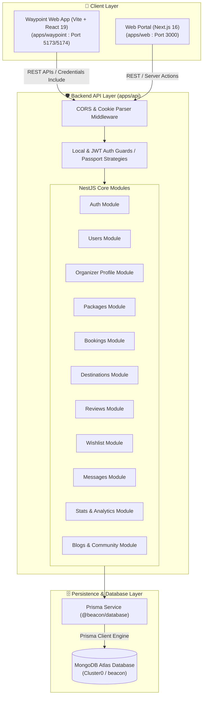
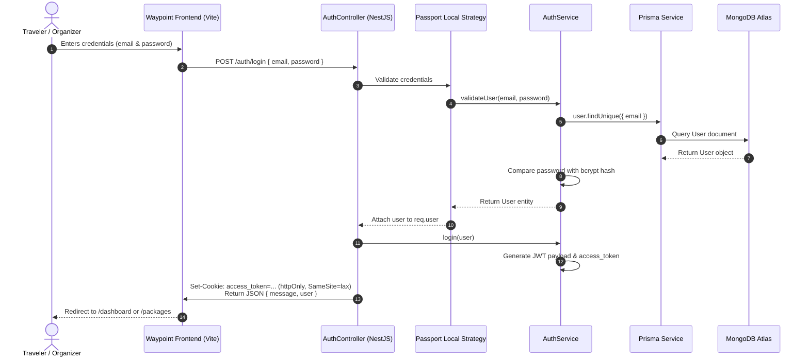
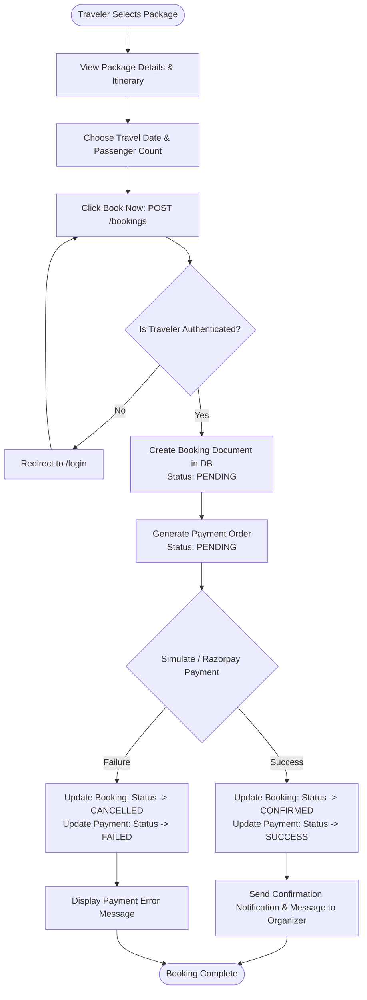
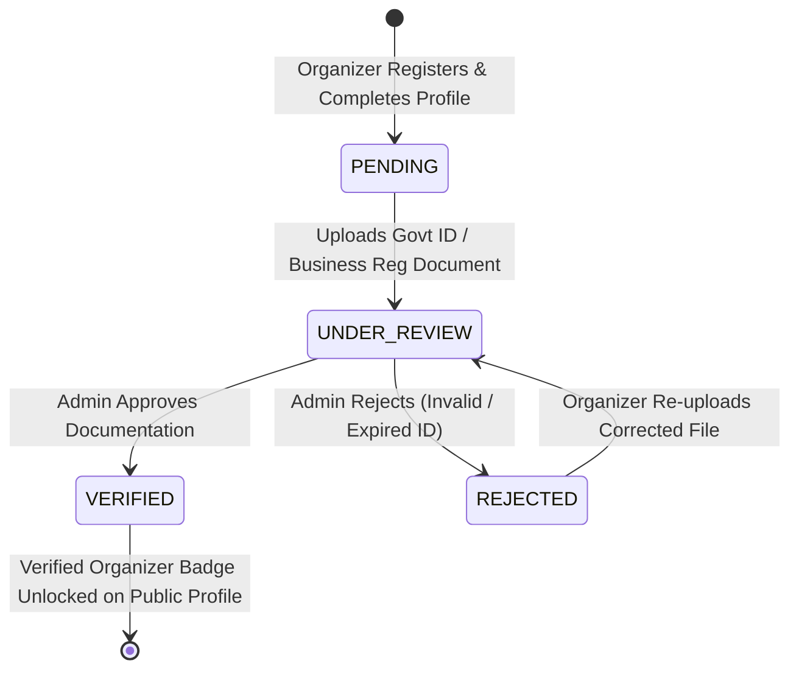
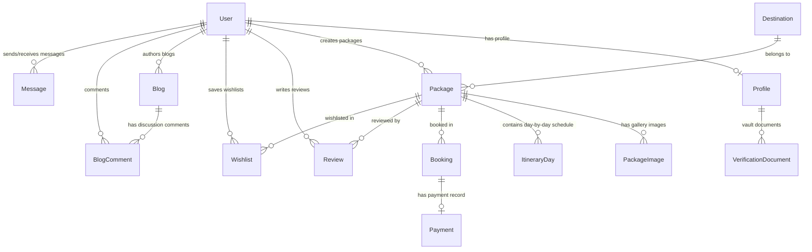

# 🏔️ Beacon - Next-Generation Travel Marketplace & Itinerary Ecosystem

[](https://github.com/sawantyash07/Beacon)
[](https://nodejs.org)
[](https://nestjs.com)
[](https://react.dev)
[](https://nextjs.org)
[](https://www.typescriptlang.org)
[](https://www.prisma.io)
[](https://www.mongodb.com)
[](https://tailwindcss.com)

**Beacon** is an enterprise-grade, end-to-end travel marketplace monorepo platform designed to connect adventurous travelers with verified travel planners, boutique agency operators, and independent expedition leaders ("Organizers"). 

Whether creating custom multi-day itineraries, hosting group trips, tracking booking status, verifying business documentation, or facilitating real-time traveler-planner messaging, Beacon provides a seamless experience for all travel industry stakeholders.

---

## 📋 Table of Contents

- [🌟 System Overview & Core Capabilities](#-system-overview--core-capabilities)
- [🛠️ Technology Stack](#️-technology-stack)
- [🏗️ High-Level System Architecture](#️-high-level-system-architecture)
- [🔄 Data & Request Flow Diagrams](#-data--request-flow-diagrams)
- [🧩 Monorepo Codebase Structure](#-monorepo-codebase-structure)
- [📦 Module Responsibilities & Component Interaction](#-module-responsibilities--component-interaction)
- [🗄️ Database & Schema Design](#️-database--schema-design)
- [🔐 Authentication & Authorization Architecture](#-authentication--authorization-architecture)
- [📡 Comprehensive API Reference](#-comprehensive-api-reference)
- [🎯 Key Design Decisions & Engineering Strategy](#-key-design-decisions--engineering-strategy)
- [⚙️ Environment Variables & Configuration](#️-environment-variables--configuration)
- [🚀 Setup & Installation Guide](#-setup--installation-guide)
- [🧪 Testing, Build & Deployment Pipeline](#-testing-build--deployment-pipeline)
- [🤝 Contribution Guidelines](#-contribution-guidelines)

---

## 🌟 System Overview & Core Capabilities

Beacon solves the fragmentation in experiential travel planning by acting as a unified platform for both sides of the marketplace:

### 🧳 For Travelers
- **Explore & Filter Expeditions**: Search travel packages by destination, difficulty level (`EASY`, `MODERATE`, `HARD`, `EXPERT`), duration, price, and category.
- **Interactive Day-by-Day Itineraries**: View granular daily schedules, activity lists, meal inclusions, hotel details, and geographical mapping coordinates.
- **Direct Trip Booking**: Simple checkout process with passenger count selection, date picking, total calculation, and payment status updates.
- **Wishlist & Favorites**: Save packages for future trips.
- **Reviews & Ratings**: Share feedback and ratings for packages and destinations.
- **Direct Messaging**: Communicate directly with verified trip planners and organizers before and after booking.

### 🧭 For Travel Planners & Organizers (Company & Freelancers)
- **Multi-Section Organizer Hub**: 10-section profile manager covering basic info, travel expertise, operating locations, business credentials, active services, availability SLA, banking, social links, preferences, and security settings.
- **Verification Vault**: Upload official credentials (Govt ID, PAN, GST, Business Registration, Tourism License) with status tracking (`PENDING` -> `UNDER_REVIEW` -> `VERIFIED` / `REJECTED`).
- **Visual Package Builder**: Multi-step package editor allowing organizers to configure pricing, day-by-day itineraries, inclusions/exclusions, cover photos, and gallery images.
- **Booking & Lead Management**: Monitor incoming bookings, update booking states (`PENDING`, `CONFIRMED`, `CANCELLED`), track payments, and capture inquiries.
- **Interactive Performance Analytics**: Real-time charts for monthly revenue breakdown, package conversion rates, customer ratings, and traveler demographics.

---

## 🛠️ Technology Stack

| Layer | Tech / Tool | Description |
| :--- | :--- | :--- |
| **Monorepo Management** | **NPM Workspaces** | Native Node.js monorepo workspace orchestration (`apps/*`, `packages/*`) |
| **Backend API Framework** | **NestJS 11** | Scalable, modular TypeScript server framework with Dependency Injection |
| **Database ORM** | **Prisma 6** | Type-safe ORM connecting to MongoDB Atlas with auto-generated types |
| **Database** | **MongoDB Atlas** | NoSQL document database optimized for complex itinerary sub-documents |
| **Authentication** | **Passport.js & JWT** | Dual Passport Local & JWT strategy with HTTP-Only cookie delivery & password hashing via `bcrypt` |
| **Client Application** | **React 19 + Vite 8** | `apps/waypoint` - High-performance React SPA with React Router v7 & TailwindCSS v4 |
| **Web Portal Application** | **Next.js 16** | `apps/web` - React 19 App Router framework for SSR portal features |
| **UI Components & Styling** | **TailwindCSS v4, Lucide Icons, Framer Motion, Sonner** | Glassmorphism aesthetics, micro-animations, toast notifications, responsive design |
| **Charts & Data Viz** | **Recharts** | Dynamic analytics charts for organizer dashboard revenue & booking metrics |
| **Form Validation** | **React Hook Form & Zod** | Schema-driven form handling and robust data validation |

---

## 🏗️ High-Level System Architecture

Beacon is organized into a clean monorepo architecture separating backend micro-services/REST APIs, client single-page applications (SPA), server-rendered web portals, and shared database domain logic.



---

## 🔄 Data & Request Flow Diagrams

### 1. Authentication & JWT Cookie Flow

The authentication system employs Passport Local Strategy for login validation and issues a secure `httpOnly` JWT cookie for session maintenance across the client applications.



### 2. Package Booking & Status Flowchart



### 3. Organizer Verification Vault State Machine



---

## 🧩 Monorepo Codebase Structure

```
d:\Beacon
├── .env                       # Root environment variables configuration
├── .gitignore                 # Git ignore specs for node_modules, dist, builds
├── package.json               # Root monorepo package setup & NPM workspace scripts
├── to run.txt                 # Quick developer execution cheat sheet
├── apps/                      # Monorepo Application Directory
│   ├── api/                   # NestJS REST API Backend
│   │   ├── src/
│   │   │   ├── main.ts        # Bootstrap entrypoint, dynamic port detection, CORS, cookie parser
│   │   │   ├── app.module.ts  # Main NestJS module aggregating all domain modules
│   │   │   ├── app.controller.ts
│   │   │   ├── app.service.ts
│   │   │   ├── auth/          # Authentication, Guards, Local & JWT Passport Strategies
│   │   │   ├── users/         # User management domain
│   │   │   ├── organizer-profile/ # Organizer 10-section profile & Verification Vault logic
│   │   │   ├── packages/      # Travel package CRUD, search, filter & itinerary builder
│   │   │   ├── bookings/      # Traveler bookings, checkout & status processing
│   │   │   ├── destinations/  # Travel destination catalog & weather insights
│   │   │   ├── reviews/       # Rating & comment evaluation engine
│   │   │   ├── wishlist/      # Saved traveler package favorites
│   │   │   ├── blogs/         # Travel story publishing, likes & comments
│   │   │   ├── messages/      # Real-time chat service between travelers & planners
│   │   │   ├── newsletter/    # Email subscription handling
│   │   │   ├── stats/         # Telemetry & dashboard metrics provider
│   │   │   └── prisma/        # Global Prisma ORM service wrapper
│   │   └── package.json
│   │
│   ├── waypoint/              # Main Vite + React 19 Frontend Web Application
│   │   ├── src/
│   │   │   ├── App.tsx        # React Router v7 animated routing & Auth Context wrapper
│   │   │   ├── main.tsx       # Vite React application entrypoint
│   │   │   ├── index.css      # Design tokens, custom scrollbars & glassmorphism theme
│   │   │   ├── components/    # Modular component tree
│   │   │   │   ├── auth/      # Auth form controls & social buttons
│   │   │   │   ├── dashboard/ # Dashboard layout, sidebar navigation, topbar & stats widgets
│   │   │   │   ├── landing/   # Hero banner, featured trips, top planners & CTA blocks
│   │   │   │   └── ui/        # Reusable UI primitives (Buttons, Cards, Dialogs, Inputs, Skeletons)
│   │   │   ├── context/       # AuthContext for global user state & session handling
│   │   │   ├── pages/         # Application Views / Screens
│   │   │   │   ├── LandingPage.tsx
│   │   │   │   ├── LoginPage.tsx
│   │   │   │   ├── SignUpPage.tsx
│   │   │   │   ├── ForgotPasswordPage.tsx
│   │   │   │   ├── about/
│   │   │   │   ├── blogs/
│   │   │   │   ├── booking/
│   │   │   │   ├── contact/
│   │   │   │   ├── destinations/
│   │   │   │   ├── packages/
│   │   │   │   ├── wishlist/
│   │   │   │   └── dashboard/ # 12 Organizer & Traveler Management Views
│   │   │   │       ├── OverviewPage.tsx
│   │   │   │       ├── PackagesPage.tsx
│   │   │   │       ├── PackageCreatePage.tsx
│   │   │   │       ├── PackageEditPage.tsx
│   │   │   │       ├── BookingsPage.tsx
│   │   │   │       ├── InquiriesPage.tsx
│   │   │   │       ├── TripGroupsPage.tsx
│   │   │   │       ├── SocialMediaPage.tsx
│   │   │   │       ├── MessagesPage.tsx
│   │   │   │       ├── PaymentsPage.tsx
│   │   │   │       ├── AnalyticsPage.tsx
│   │   │   │       └── OrganizerProfilePage.tsx
│   │   │   ├── routes/        # ProtectedRoute wrapper component
│   │   │   ├── services/      # Fetch API clients (api.ts, auth.ts)
│   │   │   └── utils/         # Helper functions & form formatters
│   │   └── package.json
│   │
│   └── web/                   # Next.js 16 (App Router) Secondary Web Portal
│       ├── src/
│       │   ├── app/           # App router page hierarchy (/login, /register, /packages, /planner, etc.)
│       │   ├── components/    # Shared Next.js UI components
│       │   └── middleware.ts  # Route authorization middleware
│       └── package.json
│
└── packages/                  # Monorepo Shared Package Directory
    └── database/              # Shared Prisma & MongoDB Database Layer
        ├── prisma/
        │   └── schema.prisma  # Master Prisma Schema (15+ Data Models & Enums)
        ├── index.ts           # Shared exports (@beacon/database)
        └── package.json
```

---

## 📦 Module Responsibilities & Component Interaction

| Module / Package | Responsibility & Role | Primary Consumers / Dependents |
| :--- | :--- | :--- |
| **`@beacon/database`** | Defines master MongoDB schema, Prisma generator specs, data enums, relational cascading rules, and exposes Prisma Client. | `apps/api`, database migration scripts |
| **`AuthModule`** | Manages user registration, bcrypt password hashing, Passport Local strategy login, JWT token generation, cookie parsing, and profile lookup. | All client apps (`waypoint`, `web`), Protected routes |
| **`OrganizerProfileModule`** | Handles deep 10-section profile editing (expertise, locations, SLA, banking) and document verification file uploads. | `Waypoint Dashboard -> OrganizerProfilePage` |
| **`PackagesModule`** | Full CRUD for travel packages, day-by-day itinerary arrays, photo galleries, price discounts, and filtering algorithms. | `PackagesExplorePage`, `PackageDetailPage`, `PackageCreatePage` |
| **`BookingsModule`** | Manages booking lifecycles (`PENDING` -> `CONFIRMED` -> `CANCELLED`), passenger counts, total costs, and payment linkages. | `BookingPage`, `BookingsPage (Dashboard)` |
| **`MessagesModule`** | Direct message storage and communication exchange between travelers and organizers. | `MessagesPage (Dashboard)` |
| **`StatsModule`** | Aggregates system metrics (active packages, revenue sum, total travelers served, booking conversion). | `OverviewPage`, `AnalyticsPage` |
| **`DestinationsModule`** | Curates top geographic travel spots, weather insights, best visiting seasons, and high-resolution galleries. | `DestinationsPage`, `DestinationDetailPage` |

---

## 🗄️ Database & Schema Design

The Beacon database layer is constructed with **Prisma ORM** targeting **MongoDB Atlas**. MongoDB was specifically chosen for its document model flexibility, allowing nested sub-documents (such as day-by-day itinerary arrays and dynamic service toggles) to be stored alongside tabular user credentials.



### Core Model Breakdown

#### 1. `User` Model
- **`id`**: `ObjectId` (`@id @map("_id")`)
- **`email`**: String (Unique)
- **`password`**: String (Nullable for OAuth users)
- **`role`**: Enum (`TRAVELER`, `PLANNER`, `ADMIN`)
- **`partnerType`**: Enum (`COMPANY`, `FREELANCER`)
- **`mobileNumber`**, **`name`**, **`age`**, **`gender`**: Optional metadata

#### 2. `Profile` Model (Organizer & Traveler Master Hub)
- **Basic Info**: `displayName`, `bio`, `avatarUrl`, `coverBannerUrl`, `phone`, `whatsappNumber`, `city`, `country`.
- **Travel Expertise**: `specializations[]`, `languages[]`, `travelStyles[]`, `groupSizes[]`, `yearsExperience`.
- **Operating Locations**: `countriesServed[]`, `operatingRegions[]`, `popularDestinations[]`.
- **Business Credentials**: `companyName`, `registrationNumber` (CIN/LLPIN), `gstNumber`, `panNumber`, `companyWebsite`, `officeAddress`, `occupation`, `govtIdType`, `govtIdNumber`.
- **Service Toggles**: Boolean flags for `serviceFlights`, `serviceHotels`, `serviceMeals`, `serviceLocalTransport`, `serviceVisaAssistance`, `serviceTravelInsurance`, `serviceTourGuide`, `serviceCustomizedItinerary`.
- **Availability & Banking**: `workingDays[]`, `workingHoursStart/End`, `responseTimeSla`, `bankAccountName`, `bankAccountNumber`, `bankName`, `ifscOrSwiftCode`, `upiOrPaypalId`.
- **Verification Status**: `isVerified` (Boolean), `verificationProgress` (`PENDING`, `UNDER_REVIEW`, `VERIFIED`, `REJECTED`), `rejectionReason`.
- **Performance Metrics**: `partnerLevel`, `averageRating`, `tripsCompleted`, `happyTravelers`, `responseRate`.

#### 3. `Package` & `ItineraryDay` Models
- **`Package`**: `title`, `description`, `destination`, `days`, `nights`, `basePrice`, `discountedPrice`, `category`, `difficulty` (`EASY`, `MODERATE`, `HARD`, `EXPERT`), `status` (`DRAFT`, `PUBLISHED`, `ARCHIVED`), `inclusions[]`, `exclusions[]`.
- **`ItineraryDay`**: `dayNumber`, `title`, `description`, `activities[]`, `meals[]`, `hotelName`, `hotelAddress`, `latitude`, `longitude`.

#### 4. `Booking` & `Payment` Models
- **`Booking`**: `travelerId`, `packageId`, `travelDate`, `passengerCount`, `totalAmount`, `status` (`PENDING`, `CONFIRMED`, `CANCELLED`).
- **`Payment`**: `bookingId`, `amount`, `currency` (Default: "INR"), `status` (`PENDING`, `SUCCESS`, `FAILED`), `razorpayOrderId`, `razorpayPaymentId`.

---

## 🔐 Authentication & Authorization Architecture

Beacon enforces security across client and server applications through a multi-tiered security model:

1. **Password Encryption**: User passwords are encrypted using `bcrypt` (10 rounds) prior to storage.
2. **Passport Local Strategy**: Handles initial `/auth/login` requests by verifying email/password matches.
3. **JWT Session Tokens**: Issued upon successful authentication, containing `userId`, `email`, `role`, and `partnerType`.
4. **HTTP-Only Cookie Delivery**: Tokens are written directly into an HTTP-Only cookie (`access_token`) with `sameSite: 'lax'`, shielding credentials from XSS attacks.
5. **Role-Based Guards (`JwtAuthGuard`)**: Endpoints are protected by NestJS guards that decode incoming JWT cookies or Authorization Bearer headers to enforce permissions for `TRAVELER`, `PLANNER`, or `ADMIN`.

---

## 📡 Comprehensive API Reference

### 🔑 Auth Endpoints (`/auth`)
| Method | Endpoint | Access Guard | Description |
| :--- | :--- | :--- | :--- |
| `POST` | `/auth/register` | Public | Register a new user (`TRAVELER` or `PLANNER`) |
| `POST` | `/auth/login` | LocalAuthGuard | Authenticate user & set `access_token` HTTP-Only cookie |
| `POST` | `/auth/logout` | Public | Clear `access_token` cookie & destroy session |
| `GET` | `/auth/profile` | JwtAuthGuard | Retrieve current logged-in user profile payload |

### 🧭 Organizer Profile Endpoints (`/organizer-profile`)
| Method | Endpoint | Access Guard | Description |
| :--- | :--- | :--- | :--- |
| `GET` | `/organizer-profile/me` | JwtAuthGuard | Get active planner's full 10-section profile & document vault |
| `PATCH` | `/organizer-profile/me/section/:sectionKey` | JwtAuthGuard | Update specific section key (e.g., `expertise`, `banking`, `services`) |
| `POST` | `/organizer-profile/me/verification/upload` | JwtAuthGuard | Upload verification credential to document vault |
| `GET` | `/organizer-profile/public/:id` | Public | Fetch public-facing organizer profile with metrics & badges |

### 📦 Packages Endpoints (`/packages`)
| Method | Endpoint | Access Guard | Description |
| :--- | :--- | :--- | :--- |
| `GET` | `/packages` | Public | List all published packages with optional search/category filter |
| `GET` | `/packages/:id` | Public | Fetch complete package details including itinerary & organizer |
| `POST` | `/packages` | JwtAuthGuard | Create a new travel package with itinerary days & pricing |
| `PATCH` | `/packages/:id` | JwtAuthGuard | Update existing package details or status (`PUBLISHED`/`DRAFT`) |
| `DELETE` | `/packages/:id` | JwtAuthGuard | Remove a package from marketplace |

### 🎟️ Bookings & Payments Endpoints (`/bookings`)
| Method | Endpoint | Access Guard | Description |
| :--- | :--- | :--- | :--- |
| `GET` | `/bookings` | JwtAuthGuard | List bookings for current user (traveler or planner view) |
| `POST` | `/bookings` | JwtAuthGuard | Create a new trip reservation & generate payment order |
| `PATCH` | `/bookings/:id/status` | JwtAuthGuard | Update booking status (`CONFIRMED`, `CANCELLED`) |

### 📊 Stats & Reviews Endpoints (`/stats`, `/reviews`, `/destinations`)
| Method | Endpoint | Access Guard | Description |
| :--- | :--- | :--- | :--- |
| `GET` | `/stats` | Public | Fetch platform summary stats for landing & dashboard overview |
| `GET` | `/destinations` | Public | List featured travel destinations with weather info |
| `GET` | `/reviews` | Public | Fetch traveler reviews & ratings |

---

## 🎯 Key Design Decisions & Engineering Strategy

1. **Monorepo Architecture (NPM Workspaces)**:
   - *Rationale*: Storing `api`, `waypoint`, `web`, and `database` in a single monorepo ensures atomic changes across frontend contracts and backend Prisma schemas without maintaining multiple repositories.

2. **Vite + React 19 for Waypoint Application**:
   - *Rationale*: Provides ultra-fast Hot Module Replacement (HMR) and lightning-quick build times. React 19 enables modern concurrency primitives and state management.

3. **NestJS Modular Architecture**:
   - *Rationale*: NestJS provides clear separation of concerns (Controllers, Services, Guards, DTOs). Each feature (Auth, Packages, Bookings, Organizer Profile) resides in its self-contained domain directory.

4. **Dynamic Graceful Port Binding**:
   - *Rationale*: In `apps/api/src/main.ts`, the bootstrap code checks if port `3001` is already in use using native `net` socket checks. If occupied, it automatically increments and binds to the next available port (e.g. `3002`), preventing server crashes during dev restarts.

5. **Prisma + MongoDB Atlas**:
   - *Rationale*: Combines relational-like type safety in TypeScript with MongoDB's document flexibility. Allows rich itinerary sub-documents while maintaining foreign key relations via `@db.ObjectId`.

---

## ⚙️ Environment Variables & Configuration

Create a `.env` file in the root directory `d:\Beacon\.env`:

```env
# Database Connection (MongoDB Atlas Connection String)
DATABASE_URL="mongodb+srv://<username>:<password>@cluster0.mongodb.net/beacon?retryWrites=true&w=majority"

# Backend API Service Settings
PORT=3001
JWT_SECRET="beacon-super-secret-jwt-key-2026"
ALLOWED_ORIGINS="http://localhost:5173,http://localhost:5174,http://localhost:3000"

# Waypoint Client API Endpoint (apps/waypoint/.env)
VITE_API_URL="http://localhost:3001"
```

---

## 🚀 Setup & Installation Guide

### Prerequisites
- **Node.js**: v20.0.0 or higher
- **NPM**: v10.0.0 or higher
- **MongoDB**: Access to a MongoDB Atlas cluster or local MongoDB instance

### Step-by-Step Installation

1. **Clone the Repository**:
   ```bash
   git clone https://github.com/sawantyash07/Beacon.git
   cd Beacon
   ```

2. **Install Monorepo Dependencies**:
   ```bash
   npm install
   ```

3. **Configure Environment Variables**:
   Verify `.env` exists in the root folder with a valid `DATABASE_URL` and `JWT_SECRET`.

4. **Generate Prisma Database Client**:
   ```bash
   npm run db:generate --workspace=@beacon/database
   ```

5. **Push Schema to MongoDB**:
   ```bash
   npm run db:push --workspace=@beacon/database
   ```

---

## 🏃 Running the Applications

### Concurrent Development Run (Root Command)
To launch all workspace applications simultaneously:
```bash
npm run dev
```

### Running Individual Workspace Applications

#### Option A: NestJS Backend API Only (`apps/api`)
```bash
npm run dev --workspace=api
# Server will listen on http://localhost:3001
```

#### Option B: Waypoint React Frontend Only (`apps/waypoint`)
```bash
npm run dev:waypoint
# Vite server will launch on http://localhost:5173 or http://localhost:5174
```

#### Option C: Next.js Web Portal Only (`apps/web`)
```bash
cd apps/web
npm run dev
# Next.js app will launch on http://localhost:3000
```

---

## 🧪 Testing, Build & Deployment Pipeline

### Code Linting & Formatting
```bash
# Run ESLint & Oxlint across all workspaces
npm run lint

# Format code with Prettier in NestJS API
npm run format --workspace=api
```

### Unit & E2E Testing
```bash
# Run Jest unit tests in NestJS API
npm run test --workspace=api

# Run E2E tests
npm run test:e2e --workspace=api
```

### Production Build
```bash
# Build all monorepo applications and packages
npm run build
```

---

## 🤝 Contribution Guidelines

We welcome contributions to the Beacon Ecosystem! Follow these steps:

1. **Fork the Repository** on GitHub.
2. **Create a Feature Branch**:
   ```bash
   git checkout -b feature/amazing-travel-feature
   ```
3. **Commit your changes**:
   ```bash
   git commit -m "feat(packages): add interactive route map viewer"
   ```
4. **Push to the Branch**:
   ```bash
   git push origin feature/amazing-travel-feature
   ```
5. **Open a Pull Request** with a detailed summary of your changes.

---

<p align="center">
  Built with ❤️ for adventurous travelers and passionate trip organizers around the world.
</p>
